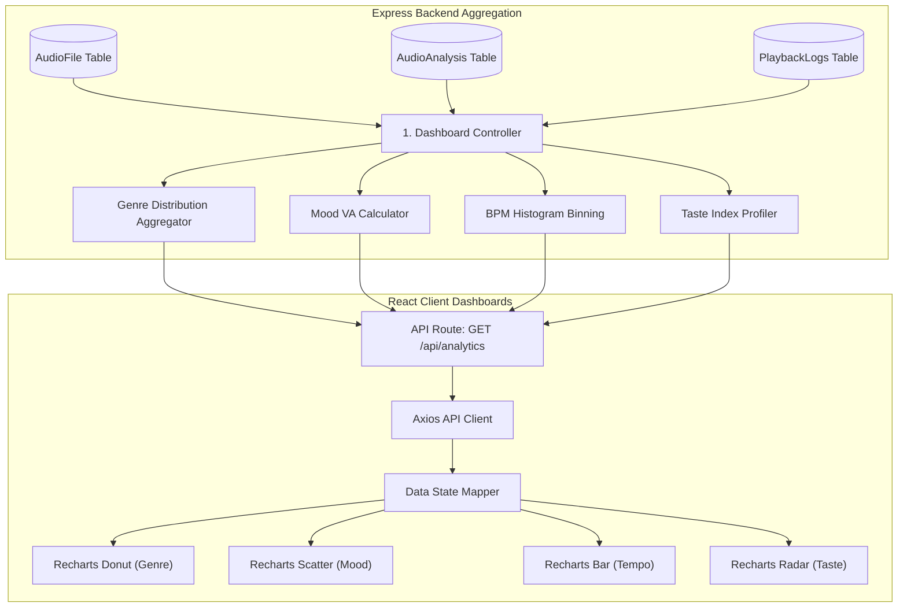

# MusicSense Analytics and Dashboards Specification

The visual interfaces, chart specifications, data source pipelines, and metric definitions of the Analytics Subsystem inside MusicSense: An AI-powered Music Intelligence Platform.

---

## Overview
The Analytics Subsystem of MusicSense translates raw audio data, relational metadata, and vector embedding relationships into interactive visual dashboards. By aggregating **Music DNA** attributes (genres, moods, tempos, keys) and **Music Genome** coordinates, the system renders multi-dimensional charts (radar charts, heatmaps, interactive force-directed graphs) that help users explore their listening behaviors and understand their music libraries.

## Purpose
Raw DSP values (e.g. spectral centroid heights, Mel-frequency coefficients) and high-dimensional vectors are unintuitive for users. The Analytics Subsystem exists to make these metrics understandable and actionable. It converts abstract audio mathematics into clear, visual charts, helping users identify stylistic biases, track mood progressions, check library quality, and explore similarity clusters.

## Design Goals
- **Music-Centric Visualizations**: Structure charts to reflect musical concepts (e.g., mapping keys to a circular Camelot Wheel or plotting moods on a Valence-Arousal coordinate grid).
- **Asynchronous Aggregation**: Perform heavy database aggregations and clustering computations asynchronously to ensure fast page loads.
- **Actionable Visual Elements**: Dashboards must act as interactive interfaces (e.g. clicking on a genre slice dynamically builds a matching smart playlist).
- **Aesthetic Cleanliness**: Avoid visual noise. Charts will use the primary Slate and Emerald palette, clean typography, and subtle transitions, avoiding distracting animations.

## Current Status
The database models support storing user files, playback telemetry, and audio analysis results. The API routers are configured to handle basic metrics queries. The visual dashboards, charting components, and interactive graphs are scheduled for frontend integration in Phase 6 (Dashboard & Player integration).

## Future Scope
We plan to implement:
- **WebGL 3D Galaxy Map**: Transitioning the 2D Similarity Network into a fully interactive 3D particle cosmos utilizing UMAP coordinates.
- **COMMUNITY Taste Overlays**: Allowing users to overlay their Taste Index radar charts with friends to compare visual overlaps.

## Possible Improvements
- **Automated Weekly Summaries**: An email service that generates and sends a personalized "Acoustic Digest" PDF displaying weekly taste variations.

---

## Dashboard Data Pipeline

The diagram below outlines how raw data flows from database tables, through aggregation utilities, and into the frontend charting components.



---

## 1. Genre Dashboard
This dashboard displays the stylistic makeup and historical trends of the user's music library.

### Chart G-101: Multi-label Genre Distribution Chart
* **Visual Representation**: Interactive Donut Chart (custom color slices based on genre classifications).
* **Purpose**: Displays the percentage composition of genres represented in the user's library, accounting for multi-label tracks (e.g., a track that is 60% electronic and 40% rock contributes to both slices).
* **Data Source**: `AudioAnalysis` table, grouping and summing the `genreDistribution` JSON values.
* **User Benefit**: Gives the user an accurate view of their stylistic preferences.

### Chart G-102: Genre Evolution Timeline
* **Visual Representation**: Stacked Area Chart (X-axis: Song release decades/years, Y-axis: Percentage composition).
* **Purpose**: Tracks how the user's genre preferences change across different eras, mapping catalog upload dates to track release decades.
* **Data Source**: Combined query from `AudioFile` (release year) and `AudioAnalysis` (genres).
* **User Benefit**: Helps users explore how their musical tastes span different eras.

---

## 2. Mood Dashboard
Provides emotional profiling of the library based on Valence (positivity) and Arousal (energy) scales.

### Chart M-101: Valence-Arousal Mood Scatter Plot
* **Visual Representation**: 2D Cartesian Coordinate Plot (X-axis: Valence 0-100%, Y-axis: Arousal/Energy 0-100%).
* **Purpose**: Plots each song as a dot on the 2D Valence-Arousal coordinate grid. Hovering over a dot reveals the track name and its explicit mood category (e.g., Happy, Calm, Sad, Aggressive).
* **Data Source**: `AudioAnalysis` metrics: `valence` (X) and `energy` (Y).
* **User Benefit**: Allows users to explore the emotional balance of their library and click on quadrants to generate matching mood playlists.

```
                      Energy / Arousal (100%)
                                 ^
           [Aggressive Metal]    |    [Upbeat Dance Pop]
                                 |
   <-----------------------------+-----------------------------> Valence (100%)
                                 |
           [Melancholic Piano]   |    [Calm Ambient Drone]
                                 v
                                (0%)
```

### Chart M-102: Daily Mood Trend Heatmap
* **Visual Representation**: 12-Month Calendar Grid Matrix (color intensity matches listening activity).
* **Purpose**: Displays a calendar view of the year, color-coded by the dominant mood of the songs played on each day.
* **Data Source**: `PlaybackLogs` merged with `AudioAnalysis` mood classifications, grouped by day.
* **User Benefit**: Displays a calendar view of the user's emotional listening patterns over the year.

---

## 3. Tempo Dashboard
Analyzes rhythmic distributions and tempo groupings across the library.

### Chart T-101: Tempo (BPM) Distribution Histogram
* **Visual Representation**: Vertical Bar Chart (X-axis: BPM Bins [e.g., 60-70, 70-80...], Y-axis: Track Count).
* **Purpose**: Groups tracks into BPM ranges to show the dominant tempos in the library.
* **Data Source**: `AudioAnalysis` table: `tempo` field, binned in 10-BPM increments.
* **User Benefit**: Displays tempo distributions, helping users choose appropriate ranges for workouts or focus sessions.

### Chart T-102: BPM vs. Energy Scatter Plot
* **Visual Representation**: 2D Scatter Chart (X-axis: BPM, Y-axis: Energy Percentage).
* **Purpose**: Analyzes the relationship between tempo and energy in the library, highlighting whether fast songs are also high-energy (helping identify fast, mellow ambient tracks or slow, heavy rock songs).
* **Data Source**: `AudioAnalysis` table: `tempo` and `energy` values.
* **User Benefit**: Helps users locate unique style combinations in their collection.

---

## 4. Listening Persona Dashboard
Provides a behavioral analysis of the user's music discovery and consumption habits.

### Chart P-101: Listening Habits Radar Chart
* **Visual Representation**: 5-Axis Polar Radar Chart.
* **Axes Evaluated**:
  1. *Exploration*: Ratio of new uploads played to overall playback count.
  2. *Consistency*: Focus on specific tempo and key ranges.
  3. *Vibrancy*: Preference for high-energy/high-valence tracks.
  4. *Focus*: Preference for instrumental/calm tracks.
  5. *Duration*: Average playback session lengths.
* **Purpose**: Maps the user's listening characteristics to determine their Listening Persona (e.g. Loyalist, Explorer).
* **Data Source**: `PlaybackLogs` telemetry, calculated over 30-day windows.
* **User Benefit**: Gamifies library interaction and provides insight into listening behaviors.

### Chart P-102: Taste Consistency Index Gauge
* **Visual Representation**: Semi-circular Gauge Chart (0 to 100).
* **Purpose**: Measures taste stability. High scores represent focused tastes; low scores represent eclectic tastes.
* **Data Source**: Calculated variance of the User Taste Index vector over time.
* **User Benefit**: Shows whether the user's tastes are staying consistent or expanding into new styles.

---

## 5. Diversity Score Dashboard
Measures the breadth of styles, genres, and eras in the library.

### Chart D-101: Library Diversity Score Meter
* **Visual Representation**: Metric Dial Gauge (0 to 100).
* **Purpose**: Displays the Library Diversity Score, calculated using Shannon Entropy over the library's genre and decade distributions.
* **Data Source**: Aggregated counts of unique genres and decades from `AudioAnalysis`.
* **User Benefit**: Encourages users to expand their musical horizons by showing a clear diversity score.

---

## 6. Taste Index Dashboard
Displays the mathematical preferences of the user's listening profile.

### Chart I-101: Taste Profile Radar Chart
* **Visual Representation**: 5-Axis Polar Radar Chart.
* **Axes Evaluated**: Energy, Valence, Danceability, Acousticness, Instrumentalness.
* **Purpose**: Displays the user's Taste Index (average acoustic preferences) compared to the platform average.
* **Data Source**: Weighted average vector calculations over the user's library and playback telemetry.
* **User Benefit**: Shows the user's acoustic preferences in a single visual chart.

### Chart I-102: Taste Drift Timeline
* **Visual Representation**: Multi-line Chart (X-axis: Months, Y-axis: Attribute Averages 0-100%).
* **Purpose**: Tracks how preferences for key features (e.g. Energy, Acousticness) change over months.
* **Data Source**: Monthly snapshots of the calculated User Taste Index.
* **User Benefit**: Visualizes how musical preferences change over seasons or years.

---

## 7. Similarity Network Dashboard
An interactive map displaying connections between tracks in the library.

### Chart S-101: 2D Interactive Similarity Node Graph
* **Visual Representation**: 2D Force-Directed Network Graph (using D3.js).
* **Nodes**: Music files (color-coded by dominant genre).
* **Edges**: Links connecting songs with a cosine distance $\le 0.15$.
* **Purpose**: Visualizes similarity relationships across the library. Users can click nodes to play tracks, view DNA cards, and build transition playlists between distant nodes.
* **Data Source**: Cosine distance matrix calculations over all `AudioAnalysis` embeddings in the user's library.
* **User Benefit**: Displays the visual structure of the music library, showing isolated style clusters and interconnected groups.

---

## 8. Music DNA Cards
The primary visual interface for displaying individual track metrics.

### Layout C-101: Individual Track DNA Visualizer
* **Visual Representation**: Unified Dashboard Card with a dynamic background color matched to the track's mood coordinates.
* **Included Components**:
  * **Radar Chart**: Displaying 5 core acoustic attributes.
  * **Harmonic Identifier**: Displays root key and Camelot Wheel code (e.g. "6A - G Minor") colored by harmonic compatibility.
  * **Tempo Badge**: Shows BPM and dynamic tempo drift.
  * **Static Waveform**: Displays a static waveform image segmented into color-coded structural sections (Intro, Verse, Chorus, Outro).
* **Purpose**: Provides an immediate, engaging visual summary of a track's acoustic and structural DNA.
* **Data Source**: Joined query of `MusicFile`, `AudioAnalysis`, and structural segment JSON models.
* **User Benefit**: Explains the song's musical properties visually at a glance.

---

## 9. Library Insights
Provides diagnostic reports and catalog statistics.

### Chart L-101: Decade Distribution Chart
* **Visual Representation**: Horizontal Bar Chart.
* **Purpose**: Displays the distribution of track release dates across decades.
* **Data Source**: `MusicFile` metadata fields.
* **User Benefit**: Shows the temporal span of the user's collection.

### Chart L-102: Audio Quality Auditor
* **Visual Representation**: Split Pie Chart.
* **Purpose**: Displays the ratio of file formats (MP3, FLAC, WAV) and bitrates, flagging low-quality or corrupted files.
* **Data Source**: Technical metadata parsed during ingestion.
* **User Benefit**: Helps users locate low-quality files that need replacement.
