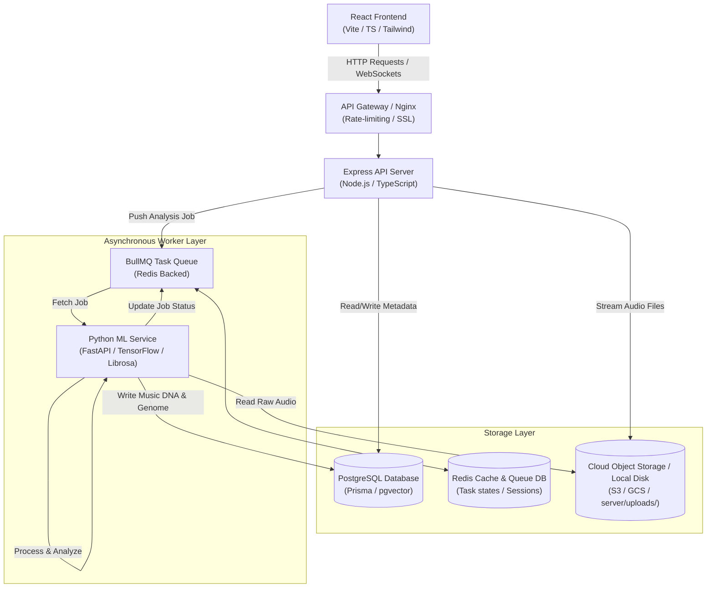
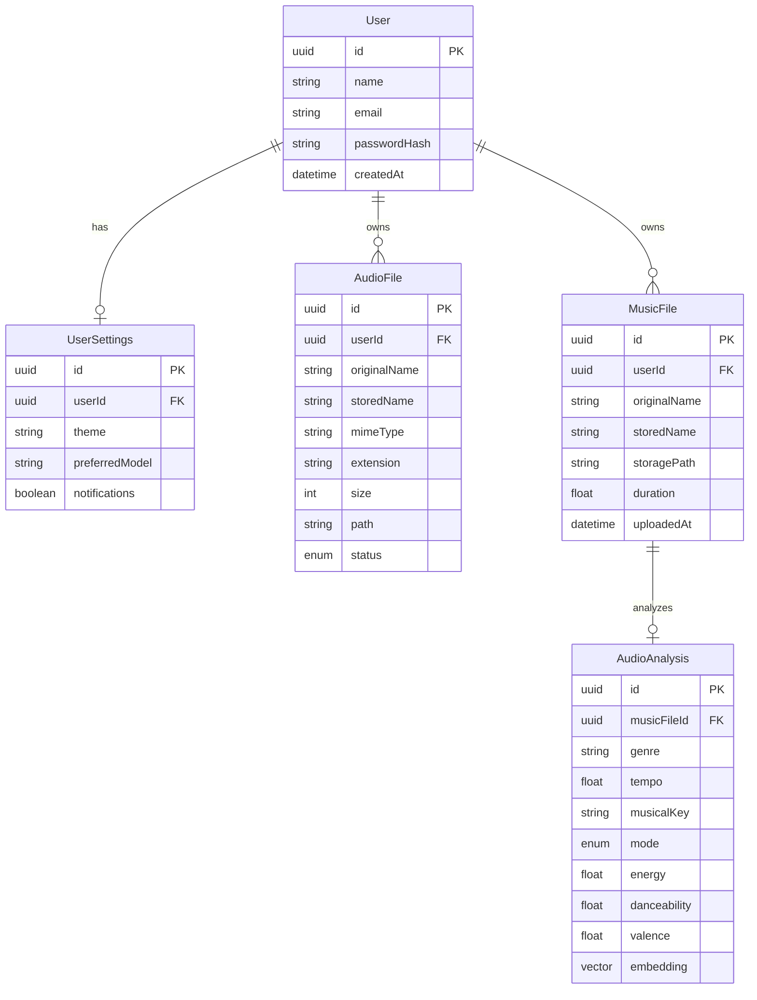
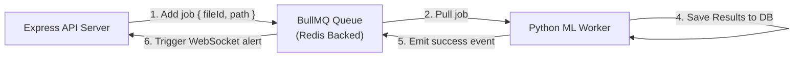
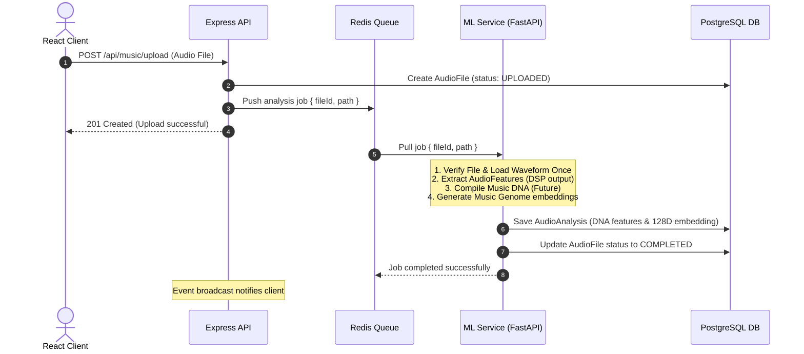
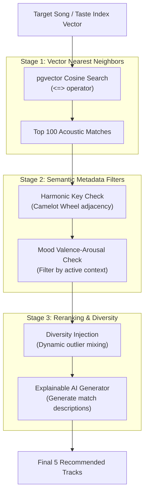

# MusicSense System Architecture Specification

The complete technical specification of the system components, data schemas, service boundaries, processing pipelines, and deployment topologies of MusicSense: An AI-powered Music Intelligence Platform.

---

## Overview
MusicSense is built on a decoupled, asynchronous, 3-tier service architecture. Designed to handle compute-intensive digital signal processing (DSP) and neural network inference alongside low-latency REST API requests, the system separates concerns across three major areas:
1. **Interactive Client Layer (Frontend)**: React, TypeScript, and Tailwind CSS.
2. **Business & Coordination Layer (Backend)**: Node.js, Express, Prisma ORM, and PostgreSQL.
3. **Audio Intelligence Layer (ML Service)**: Python, FastAPI, Librosa, and TensorFlow.

This specification details how these systems connect, store data, queue tasks, authenticate users, and compute recommendations.

## Purpose
Digital signal processing and machine learning inference are resource-heavy operations that block threads. Mixing these operations inside a standard API server degrades performance, leading to timeouts and a poor user experience. 

This architecture isolates these workloads:
* The **Express Server** handles lightweight metadata coordination, routing, and user states.
* The **Python Microservice** handles intensive math and tensor operations.
* The **Redis/BullMQ Queue System** manages long-running analyses asynchronously.
* The **pgvector PostgreSQL database** enables fast, spatial vector searches.

## Design Goals
- **Service Isolation**: Ensure compute-heavy audio analysis does not impact the responsiveness of the web client or REST API.
- **Asynchronous Processing**: Run ingestion and feature extraction in background queues to handle high upload volumes.
- **Strict Data Integrity**: Enforce type safety from the database layer (via Prisma) to client interfaces.
- **Storage Independence**: Decouple the file storage layer, allowing seamless transitions from local disk sandboxes to cloud object storage buckets.
- **Explainable Operations**: Expose intermediate model states (Music DNA) to make recommendations and clustering transparent.

## Current Status
The database models, migrations, REST endpoints, user authentication (JWT), and the Multer-based file upload pipeline are complete. The Python ML service is in the design phase, and the Express-to-FastAPI HTTP connector is active.

## Future Scope
- **Production Queue Integration**: Implementing BullMQ and Redis to shift from synchronous HTTP hooks to an asynchronous task worker topology.
- **Cloud Bucket Migration**: Swapping local uploads for Google Cloud Storage (GCS) or Amazon S3.
- **pgvector Optimization**: Enabling Hierarchical Navigable Small World (HNSW) index structures in production.

## Possible Improvements
- **Edge Analytics**: Compiling preprocessing modules to WebAssembly to execute basic analyses (like duration or BPM detection) directly in the browser.

---

## 1. High-Level System Architecture

The diagram below details the architecture of MusicSense, showing the communication channels, cache nodes, databases, and storage targets.

---

## 2. Frontend Client Architecture
The frontend is built as a single-page application (SPA) optimized for low bundle sizes, responsive layouts, and interactive visual rendering.
- **Technology Stack**: React 18, TypeScript, Vite, Tailwind CSS, shadcn/ui, Recharts, Lucide React, Axios.
- **State Management**: Uses local React state (`useState`, `useReducer`) for view-specific operations, and React Context for global states (e.g. `AuthContext` for user sessions, `PlayerContext` for playback state).
- **Network Interface**: Global Axios client wrapper configured with base URLs and request interceptors to automatically attach the `Authorization: Bearer <JWT>` token.
- **Audio Visualizer**: Uses the browser's Web Audio API (`AudioContext`, `AnalyserNode`) to extract real-time frequency data during playback, mapping it to HTML5 Canvas elements for spectrogram and waveform rendering.

---

## 3. Backend API Server Architecture
The backend is a Node.js Express REST application built with TypeScript, acting as the main coordinator.
- **Technology Stack**: Node.js, Express, TypeScript, Prisma ORM, TS-Node, Multer.
- **Routing & Controllers**: Maps HTTP methods to controllers that handle input validation, delegate database transactions, and interface with storage and queue APIs.
- **Middleware Layer**:
  - `authenticateJWT`: Validates incoming tokens.
  - `uploadFilter`: Multer limits uploads to 25MB and verified audio MIME types.
  - `errorHandler`: Global handler that catches exceptions, logs stack traces, cleans up failed file writes, and returns clean JSON error payloads.
- **Data Coordination**: Coordinates cascading operations. For example, deleting a user account triggers a transaction that deletes database rows and clears physical files from the storage layer.

---

## 4. ML Service Architecture
The ML service operates as a dedicated microservice optimized for CPU-bound computations and scientific data structures.
- **Technology Stack**: Python 3.10, FastAPI, Librosa, NumPy, TensorFlow 2.x, SciPy.
- **Interface**: FastAPI hosts a REST interface that exposes endpoints like `/analyze` and `/health`, using Pydantic models for request and response validation.
- **Analysis Pipeline**: Decodes audio formats, loads the audio waveform once, and extracts core properties and acoustic features (Duration, Sample Rate, Channels, Tempo, RMS, ZCR, Spectral Centroid, Spectral Bandwidth, Spectral Roll-off, Spectral Contrast, MFCCs, Chroma, HPSS energies, and Silence Ratio) as an `AudioFeatures` object. This object acts as the input to the downstream semantic interpretation layer (Music DNA Compiler) and latent space embeddings (`MusicGenome`).

---

## 5. Database Architecture
The database layer uses PostgreSQL managed via Prisma ORM, storing user metadata and vector representations.

- **Vector Storage**: Uses the `pgvector` extension. The `AudioAnalysis` table includes a `vector(128)` type column for Music Genome embeddings.
- **Database Indexing**: Uses HNSW (Hierarchical Navigable Small World) indices on vector columns to support fast cosine similarity searches.

---

## 6. Queue System Architecture
To handle large volumes of audio uploads, MusicSense decouples ingestion from analysis using a task queue.

- **BullMQ**: Manages job creation, retries, and failures.
- **Redis Cache**: Serves as the message broker, storing job states (`waiting`, `active`, `completed`, `failed`).
- **Worker Coordination**: The API server uploads files, creates database entries with a `PROCESSING` status, and pushes a job to Redis. The Python service pulls the job, processes the audio, updates the database status to `COMPLETED`, and alerts the API server.

---

## 7. File Storage Subsystem
The storage layer isolates raw binary audio data from metadata database tables.
- **Local Sandbox Storage**: For development, files are written to `server/uploads/` using UUID filenames (e.g. `550e8400.mp3`) to protect internal directory paths.
- **Cloud Object Storage (S3/GCS)**: For production, the API server streams uploads directly to an S3/GCS bucket, storing the remote URL in the database.
- **Cascading Deletion Lifecycle**: Deleting an audio record from the database triggers a hook that removes the physical file from storage, preventing orphan files.

---

## 8. Authentication & Security Layer
- **JSON Web Tokens (JWT)**: Users authenticate via signed, stateless JWTs containing user context (`userId`, `email`).
- **BCrypt**: Hashes user passwords with 10 salt rounds before database storage.
- **Route Authorization**: Express middleware intercepts requests to protected routes, validating signatures against `JWT_SECRET` and appending session data to the request (`req.user`).
- **CORS & Rate Limiting**: The API server implements CORS filters and rate limiters to block brute-force attacks and restrict resource consumption.

---

## 9. AI Processing Pipeline
This pipeline processes raw uploads to generate Music DNA and Genome embeddings.

---

## 10. Recommendation Pipeline
The recommendation engine uses a multi-stage filtering pipeline to suggest tracks based on acoustic similarity.

