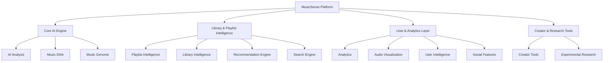

# MusicSense Planned Features Catalog

An exhaustive list of features mapping the development path for MusicSense: An AI-powered Music Intelligence Platform.

---

## Overview
This catalog describes the detailed features required to transform MusicSense from a basic genre classifier into a full-scale Music Intelligence Platform. Features are organized into 13 thematic categories spanning core machine learning pipelines, user analytics, creator interfaces, and experimental research.

## Purpose
This document provides a single source of truth for the product roadmap. It assists engineers in understanding the dependencies, engineering difficulties, priorities, and long-term design visions associated with each individual capability of the system.

## Design Goals
- **Decoupling**: Ensure frontend visualizations and API layers remain decoupled from the compute-intensive audio analysis pipelines.
- **Traceability**: Establish clear dependency links between raw audio signal features and user-facing intelligence layers.
- **Scalability**: Structure features so they can be implemented iteratively without breaking existing database schemas or route controllers.

## Current Status
The upload pipeline and authentication layers are operational. The core ML feature-extraction service is currently being designed inside the `ml-service` module. None of the advanced features listed in this catalog have been implemented.

## Future Scope
This catalog represents the complete multi-year product roadmap. Features are prioritized into High, Medium, and Low buckets to guide sprint planning, model training phases, and UI releases.

## Possible Improvements
- Integrating automated progress flags (e.g., linked to GitHub commits or Jira states) to reflect development progress directly in this file.
- Creating visual coverage matrices mapping features against database schemas to trace schema updates.

---

## Feature Category Taxonomy

---

## 1. AI Analysis
Core DSP and machine learning pipelines that run inference on raw audio files to extract low-level and high-level descriptors.

### F-101: Multi-label Genre Prediction
- **Description**: Predict multiple genres with corresponding probability scores for a single track.
- **Why it exists**: Music rarely fits into a single genre; multi-label classification represents modern musical blending accurately.
- **Priority**: High
- **Dependencies**: Librosa feature extractor, Trained TensorFlow model, `AudioAnalysis` database model.
- **Difficulty**: Medium
- **Future ideas**: Dynamic category generation based on streaming charts.

### F-102: Acoustic Mood Detection
- **Description**: Classify the emotional state of a song (e.g., Happy, Calm, Dark, Aggressive) using acoustic parameters.
- **Why it exists**: Enables mood-based search and context-specific playlists.
- **Priority**: High
- **Dependencies**: Valence-Arousal extraction models, Librosa.
- **Difficulty**: Hard
- **Future ideas**: Personalize mood thresholds based on user feedback.

### F-103: Dynamic BPM Tracking
- **Description**: Calculate average BPM and track tempo changes/drift over the duration of the song.
- **Why it exists**: Necessary for beat-matching, smooth playlist transitions, and workout classifications.
- **Priority**: High
- **Dependencies**: Tempogram calculation in Librosa.
- **Difficulty**: Medium
- **Future ideas**: Track tempo micro-fluctuations in live performances.

### F-104: Structural Segmentation
- **Description**: Identify structural sections of a track (e.g., Intro, Verse, Chorus, Bridge, Outro).
- **Why it exists**: Allows users to preview specific parts of a song or analyze structure.
- **Priority**: Low
- **Dependencies**: Novelty curves, self-similarity matrices.
- **Difficulty**: Hard
- **Future ideas**: Automatic audio clip generator for social media sharing.

### F-105: Key & Harmonic Mode Estimation
- **Description**: Determine the root key and mode (Major/Minor) of the uploaded audio.
- **Why it exists**: Enables harmonic mixing for DJs and structured recommendations for creators.
- **Priority**: High
- **Dependencies**: Chroma feature extraction.
- **Difficulty**: Medium
- **Future ideas**: Estimate modulation points (key changes) within a song.

### F-106: Vocals vs. Instrumental Classifier
- **Description**: Predict the ratio of vocal content to instrumental accompaniment.
- **Why it exists**: Helps filter out vocal-heavy tracks for focus/ambient playlists.
- **Priority**: Medium
- **Dependencies**: Spectral flatness, MFCC analysis.
- **Difficulty**: Medium
- **Future ideas**: Separate female/male vocal identification.

### F-107: Time Signature Estimation
- **Description**: Identify the musical meter (e.g., 4/4, 3/4, 6/8) of the track.
- **Why it exists**: Important for rhythm-based classification and matching.
- **Priority**: Low
- **Dependencies**: Beat tracker, rhythm pattern extraction.
- **Difficulty**: Hard
- **Future ideas**: Flag complex polyrhythms.

### F-108: Multi-Instrument Presence Detection
- **Description**: Identify the dominant instruments active in a track (e.g., Acoustic Guitar, Synth, Acoustic Piano).
- **Why it exists**: Allows searching and filtering by instrument presence.
- **Priority**: Low
- **Dependencies**: Multi-label classifier trained on isolated instrument stems.
- **Difficulty**: Hard
- **Future ideas**: Dynamic visual notation overlay.

---

## 2. Music DNA
The structured, human-readable semantic profile generated from raw audio features.

### F-201: Audio DNA Feature Card Generator
- **Description**: Create a visual "DNA Card" showing key attributes (Energy, Danceability, Mood, Valence) in a clean layout.
- **Why it exists**: Provides an immediate, engaging visual summary of a song's personality.
- **Priority**: High
- **Dependencies**: React UI Component, `AudioAnalysis` data model.
- **Difficulty**: Easy
- **Future ideas**: Allow users to share DNA Cards directly to social media.

### F-202: Feature Normalization & Weighting
- **Description**: Standardize raw acoustic measurements into a cohesive 0-100% scale for user consumption.
- **Why it exists**: Raw DSP metrics are hard to understand; normalized percentages are intuitive.
- **Priority**: High
- **Dependencies**: Helper functions in shared utilities.
- **Difficulty**: Easy
- **Future ideas**: Adaptive normalization curves based on total library limits.

### F-203: Dynamic DNA Updates
- **Description**: Recompute DNA cards when underlying ML models or feature extractors are updated.
- **Why it exists**: Ensures the library does not drift into stale metrics when the models improve.
- **Priority**: Medium
- **Dependencies**: Background worker scheduler, model versioning fields in DB.
- **Difficulty**: Medium
- **Future ideas**: Visual diff of DNA variations between model releases.

### F-204: DNA Profile Comparison
- **Description**: Provide a side-by-side visual difference indicator between two tracks' DNA profiles.
- **Why it exists**: Explains why two songs are similar or contrasting.
- **Priority**: High
- **Dependencies**: React Comparison View, API route for track analytics.
- **Difficulty**: Easy
- **Future ideas**: Radar chart overlays for comparisons.

### F-205: DNA Fingerprint Indexing
- **Description**: Build a database index on primary DNA indicators (BPM, Energy, Key).
- **Why it exists**: Speeds up rapid database filtering during query operations.
- **Priority**: High
- **Dependencies**: Prisma schema modification, PostgreSQL indexes.
- **Difficulty**: Easy
- **Future ideas**: Read-heavy cache layer for index.

### F-206: Custom DNA Archetypes
- **Description**: Let users create and save custom DNA configurations (e.g., "Mellow Coding Vibez").
- **Why it exists**: Empowers users to curate specific acoustic targets for library sorting.
- **Priority**: Medium
- **Dependencies**: `UserSettings` extensions, saved filters DB model.
- **Difficulty**: Medium
- **Future ideas**: Dynamic playlists linked directly to saved DNA archetypes.

### F-207: DNA Historical Version Control
- **Description**: Track history of edits to metadata or manual override tags for song DNA.
- **Why it exists**: Allows correcting incorrect AI tags without losing original predictions.
- **Priority**: Low
- **Dependencies**: Prisma migration, Audit logs model.
- **Difficulty**: Medium
- **Future ideas**: Collaborative consensus tagging for shared tracks.

### F-208: DNA Serialization & Export
- **Description**: Export a song's DNA as structured JSON/CSV files.
- **Why it exists**: Enables power users and developers to analyze their music library in external notebooks.
- **Priority**: Low
- **Dependencies**: Exporter utility functions.
- **Difficulty**: Easy
- **Future ideas**: API endpoint for developer integrations.

---

## 3. Music Genome
High-dimensional audio embeddings that represent relationships in vector space.

### F-301: Audio Embeddings Extraction
- **Description**: Extract 128-dimensional dense vectors representing the deep acoustic features of each track.
- **Why it exists**: Standard classification labels miss detailed acoustic similarities. Vector embeddings capture nuanced relationships.
- **Priority**: High
- **Dependencies**: Pre-trained CNN layers in Python ML service.
- **Difficulty**: Hard
- **Future ideas**: Train custom contrastive learning model for embeddings.

### F-302: Multi-dimensional Vector Space Mapping
- **Description**: Project song embeddings into a unified spatial layout.
- **Why it exists**: Needed for geometric calculations and similarity lookups.
- **Priority**: High
- **Dependencies**: Vector projection algorithms.
- **Difficulty**: Medium
- **Future ideas**: Real-time vector addition operations (e.g., Song A + Song B).

### F-303: Vector Dimensionality Reduction
- **Description**: Reduce 128D embeddings to 2D/3D coordinates using UMAP or t-SNE for plotting.
- **Why it exists**: Enables users to explore their music library as an interactive spatial map.
- **Priority**: Medium
- **Dependencies**: UMAP-learn library in Python.
- **Difficulty**: Medium
- **Future ideas**: Interactive WebGL cluster navigation.

### F-304: Cosine Similarity Engine
- **Description**: Calculate cosine distance between track embeddings to find similar tracks.
- **Why it exists**: Core algorithm for visual distance representations and vector recommendations.
- **Priority**: High
- **Dependencies**: Matrix math libraries or vector DB query extension.
- **Difficulty**: Easy
- **Future ideas**: Perform GPU-accelerated batch calculations.

### F-305: Vector Quantization & Compression
- **Description**: Compress high-dimensional vectors to minimize database size and speed up comparisons.
- **Why it exists**: Reduces cost and latency as the music library scales.
- **Priority**: Low
- **Dependencies**: Scalar quantization logic.
- **Difficulty**: Hard
- **Future ideas**: In-memory cache indexes.

### F-306: Vector Storage (pgvector)
- **Description**: Enable `pgvector` extension in PostgreSQL to store and query embeddings natively.
- **Why it exists**: Provides enterprise-ready, scale-resilient vector search inside the main database.
- **Priority**: High
- **Dependencies**: PostgreSQL updates, Prisma raw query bindings.
- **Difficulty**: Medium
- **Future ideas**: Implement HNSW indexing for sub-millisecond lookups.

### F-307: High-dimensional Clustering
- **Description**: Group songs into clusters based on embedding density using HDBSCAN.
- **Why it exists**: Discovers implicit acoustic groupings in a library without manual tag curation.
- **Priority**: Medium
- **Dependencies**: Scikit-learn clustering algorithms.
- **Difficulty**: Hard
- **Future ideas**: Name clusters automatically using semantic keywords.

### F-308: Dynamic Genome Space Reprojection
- **Description**: Recompute spatial maps as new songs are uploaded to prevent visual cluster distortions.
- **Why it exists**: Ensures the user's library remains organized and visually accurate.
- **Priority**: Low
- **Dependencies**: Incremental projection updates.
- **Difficulty**: Hard
- **Future ideas**: Web-worker-based client-side spatial updates.

---

## 4. Playlist Intelligence
Using AI, DNA, and Genome data to automatically generate, split, and optimize playlists.

### F-401: Mood-Consistent Playlist Builder
- **Description**: Build a playlist where all tracks fall within a specific valence-arousal mood bounding box.
- **Why it exists**: Prevents jarring mood changes (e.g., heavy metal following a gentle piano piece).
- **Priority**: High
- **Dependencies**: Mood analysis features, SQL queries.
- **Difficulty**: Easy
- **Future ideas**: Integrate dynamic weather and local time parameters.

### F-402: Harmonic Transition Playlist Optimizer
- **Description**: Sort tracks in a playlist using the Camelot Wheel/Key associations to ensure perfect harmonic transitions.
- **Why it exists**: Provides a seamless listening experience similar to a professional live DJ set.
- **Priority**: Medium
- **Dependencies**: Key and mode tags, sorting algorithm.
- **Difficulty**: Medium
- **Future ideas**: Overlap crossfade points automatically using key signatures.

### F-403: Energy Arc Playlist Constructor
- **Description**: Arrange tracks to follow a specific energy arc (e.g., gradual build-up, peak-valley, ramp-down).
- **Why it exists**: Perfect for workouts, study sessions, or winding down before sleep.
- **Priority**: Medium
- **Dependencies**: Energy tags, curve-fitting algorithm.
- **Difficulty**: Medium
- **Future ideas**: Allow users to draw custom energy arcs using a canvas interface.

### F-404: Smart Playlist Splitter
- **Description**: Split a large, heterogeneous music folder into smaller, cohesive playlists.
- **Why it exists**: Declutters massive unorganized directories automatically.
- **Priority**: High
- **Dependencies**: Clustering algorithms, database updates.
- **Difficulty**: Medium
- **Future ideas**: Generate smart summary descriptions and cover art prompts.

### F-405: Duplicated Audio Identifier
- **Description**: Detect exact or acoustic duplicate files using perceptual hashing (Chromaprint).
- **Why it exists**: Recovers storage space from duplicate uploads with different names or qualities.
- **Priority**: High
- **Dependencies**: Chromaprint integration in ML pipeline.
- **Difficulty**: Medium
- **Future ideas**: Merge metadata fields of duplicate tracks.

### F-406: Collaborative Playlist Alignment
- **Description**: Create a shared playlist that balances the Taste Indexes of multiple distinct users.
- **Why it exists**: Solves the conflict of choosing music for shared car rides or parties.
- **Priority**: Low
- **Dependencies**: Social network graph, Taste Index comparisons.
- **Difficulty**: Hard
- **Future ideas**: Real-time voter override queue.

### F-407: Dynamic Playlist Freshness Refresher
- **Description**: Periodically cycle out songs from a smart playlist and insert newly analyzed matching tracks.
- **Why it exists**: Keeps automated playlists from feeling repetitive and static.
- **Priority**: Low
- **Dependencies**: Automated cron runner, dynamic queries.
- **Difficulty**: Easy
- **Future ideas**: Dynamic history logs to avoid re-inserting recently skipped songs.

### F-408: Context-Aware Playlist Generator
- **Description**: Build playlists target-matched to user contexts (e.g., Coding, Gym, Focus, Sleep).
- **Why it exists**: Saves users from configuring parameter sliders manually.
- **Priority**: High
- **Dependencies**: Pre-configured DNA configurations.
- **Difficulty**: Easy
- **Future ideas**: Integrations with smartwatch activity metrics.

---

## 5. Library Intelligence
Analytics, structural maintenance, and metadata enforcement for entire music catalogs.

### F-501: Library Genre & Mood Distribution Explorer
- **Description**: Visualize the aggregate genre and mood profiles of a user's library.
- **Why it exists**: Helps users understand their music collection's composition.
- **Priority**: High
- **Dependencies**: React Chart component, dashboard API.
- **Difficulty**: Easy
- **Future ideas**: Compare library diversity score against average platform statistics.

### F-502: Average Library BPM & Key Profiler
- **Description**: Generate stats showing the library's dominant tempos and scale signatures.
- **Why it exists**: Highlights stylistic preferences of the user.
- **Priority**: Medium
- **Dependencies**: Audio analysis records database count.
- **Difficulty**: Easy
- **Future ideas**: Show key transition compatibility metrics.

### F-503: Listening Diversity Index Calculator
- **Description**: Calculate a mathematical index (0-100) reflecting how balanced the library is across different acoustic dimensions.
- **Why it exists**: Encourages users to expand their musical horizons and discover new styles.
- **Priority**: Medium
- **Dependencies**: Entropy equations based on features distributions.
- **Difficulty**: Medium
- **Future ideas**: Provide "exploration quests" to increase the index score.

### F-504: Audio Quality & Bitrate Analyzer
- **Description**: Scan and display the sample rates, bitrates, and audio degradation of uploaded files.
- **Why it exists**: Helps audiophiles identify low-quality files that need replacement.
- **Priority**: Medium
- **Dependencies**: FFmpeg metadata parser.
- **Difficulty**: Easy
- **Future ideas**: Auto-search for high-quality alternative files.

### F-505: Library Growth & Temporal Analysis
- **Description**: Graph library growth patterns over time, mapping upload dates to musical decades.
- **Why it exists**: Displays historical listening trends and catalog expansion speed.
- **Priority**: Low
- **Dependencies**: Upload model records.
- **Difficulty**: Easy
- **Future ideas**: Visual timeline showing decade transitions.

### F-506: Orphaned & Broken File Inspector
- **Description**: Scan files on the disk to identify corrupted headers or entries missing database linkages.
- **Why it exists**: Prevents storage leaks and broken playback states.
- **Priority**: High
- **Dependencies**: Checksum checks, file path verification loops.
- **Difficulty**: Medium
- **Future ideas**: Automatic database reconstruction.

### F-507: Metadata Auto-Tagging & Correction
- **Description**: Identify mismatched artist/album tags using acoustic signatures and correct them.
- **Why it exists**: Solves messy metadata problems (e.g., misspelled artist names).
- **Priority**: Medium
- **Dependencies**: external MusicBrainz metadata API.
- **Difficulty**: Medium
- **Future ideas**: Automatic folder reorganization based on tags.

### F-508: Storage Optimization Assistant
- **Description**: Recommend low-priority, rarely-listened-to, or large files that can be compressed or deleted.
- **Why it exists**: Helps manage disk space on local storage sandboxes.
- **Priority**: Low
- **Dependencies**: Playback frequency logs, size filters.
- **Difficulty**: Easy
- **Future ideas**: Auto-transcode FLAC to MP3 for mobile synchronization.

---

## 6. Recommendation Engine
Algorithmic recommendation modules utilizing Music DNA and vector models.

### F-601: Vector Similarity Recommendation Generator
- **Description**: Generate recommendations by finding the nearest neighbors in the Music Genome vector space.
- **Why it exists**: Provides recommendations based purely on acoustic characteristics rather than popularity bias.
- **Priority**: High
- **Dependencies**: pgvector queries, similarity API routes.
- **Difficulty**: Easy
- **Future ideas**: Multi-seed similarity search (finding tracks similar to a group of 5 songs).

### F-602: Hybrid Collaborative-Content Recommendation
- **Description**: Blend acoustic vector matching with anonymous user session listening paths.
- **Why it exists**: Maximizes both musical similarity and cultural affinity.
- **Priority**: Low
- **Dependencies**: Listening history tracker, collaborative filtering matrices.
- **Difficulty**: Hard
- **Future ideas**: Adaptive weight sliders between content and social recommendation paths.

### F-603: Contrastive Taste Discovery
- **Description**: Recommend songs that are acoustically distant from the user's average taste but match their mood context.
- **Why it exists**: Prevents recommendation bubbles and helps users discover new sounds.
- **Priority**: Medium
- **Dependencies**: Taste profile invert logic, mood analysis.
- **Difficulty**: Medium
- **Future ideas**: A dedicated "Surprise Me" button.

### F-604: Mood-Based Contextual Recommendation
- **Description**: Recommend tracks matching a specific mood selection.
- **Why it exists**: Adapts recommendations to dynamic user environments.
- **Priority**: High
- **Dependencies**: Mood classification outputs.
- **Difficulty**: Easy
- **Future ideas**: Time-of-day automation.

### F-605: Key/Tempo Transition Recommendations
- **Description**: Suggest tracks that harmonize perfectly with the currently playing track.
- **Why it exists**: Designed for bedroom DJs and live mix curators.
- **Priority**: Medium
- **Dependencies**: Camelot key mapping, BPM drift index.
- **Difficulty**: Medium
- **Future ideas**: Cross-fade length predictor.

### F-606: Interactive Taste Tuner Slider
- **Description**: Provide a UI with sliders (Acousticness, Energy, Tempo) to refine active recommendations.
- **Why it exists**: Puts active control back in the user's hands instead of relying on a black-box AI.
- **Priority**: High
- **Dependencies**: React UI elements, query param bindings.
- **Difficulty**: Medium
- **Future ideas**: Save tuned parameter profiles as smart filters.

### F-607: Negative Feedback Recommendation Filter
- **Description**: Dynamically adjust embedding distance rules when a user skips recommended songs.
- **Why it exists**: Learns user preferences in real-time.
- **Priority**: Medium
- **Dependencies**: Skip tracking data models.
- **Difficulty**: Medium
- **Future ideas**: Model retraining triggers based on skip rates.

### F-608: Long-Tail Discovery Mode
- **Description**: Prioritize recommending niche or rare tracks over popular tracks in the catalog.
- **Why it exists**: Uncovers hidden gems in large library collections.
- **Priority**: Low
- **Dependencies**: Pop count indexes.
- **Difficulty**: Easy
- **Future ideas**: Spotlight feature for indie artists in shared catalogs.

---

## 7. Analytics
Visualizing listening patterns, library compositions, and recommendations metrics.

### F-701: Listening History Temporal Dashboard
- **Description**: Present a visual calendar overview of playback sessions over weeks and months.
- **Why it exists**: Visualizes listening habits and routines.
- **Priority**: High
- **Dependencies**: Playback tracking database model, charting engine.
- **Difficulty**: Medium
- **Future ideas**: Weekly review emails detailing listening metrics.

### F-702: Genre Over Time Heatmap
- **Description**: Show how a user's genre preferences change throughout the seasons or months.
- **Why it exists**: Highlights changes in listening preferences.
- **Priority**: Medium
- **Dependencies**: Heatmap visualization libraries.
- **Difficulty**: Medium
- **Future ideas**: Correlation analyses with external weather APIs.

### F-703: User Activity Peak Hours Analyzer
- **Description**: Chart the times of day when the user listens to music, broken down by tempo.
- **Why it exists**: Helps optimize scheduling (e.g., workout music in the morning vs. ambient music at night).
- **Priority**: Medium
- **Dependencies**: Time-series charts.
- **Difficulty**: Easy
- **Future ideas**: Smart notifications suggesting appropriate playlists.

### F-704: Acoustic Feature Average Trends
- **Description**: Graph how average Danceability, Energy, and Valence shift across months.
- **Why it exists**: Tracks emotional alignment with music choices.
- **Priority**: Low
- **Dependencies**: Long-term metric aggregators.
- **Difficulty**: Easy
- **Future ideas**: Interactive wellness reports.

### F-705: Recommendation CTR Tracker
- **Description**: Log recommendation clicks and skip rates to measure recommendation quality.
- **Why it exists**: Measures the effectiveness of recommendation models.
- **Priority**: High
- **Dependencies**: Click event tracking controllers.
- **Difficulty**: Easy
- **Future ideas**: Automated model comparison dashboards.

### F-706: Custom Insights Cards Generator
- **Description**: Auto-generate text summaries of listening habits (e.g., "Your tempo increased by 15 BPM this week").
- **Why it exists**: Provides snackable, interesting insights for the user.
- **Priority**: Medium
- **Dependencies**: Rule-based text generation engines.
- **Difficulty**: Medium
- **Future ideas**: LLM-driven personalized summaries.

### F-707: Library Health Metrics Dashboard
- **Description**: Show counts of incomplete tags, low-resolution files, and duplicates in a single interface.
- **Why it exists**: Simplifies maintaining a clean library.
- **Priority**: Medium
- **Dependencies**: Metadata and duplicate query indices.
- **Difficulty**: Easy
- **Future ideas**: Click-to-fix-all operations.

### F-708: Multi-User Library Overview Stats
- **Description**: aggregate analytics dashboards for family groups or teams.
- **Why it exists**: Useful for shared spaces or communities.
- **Priority**: Low
- **Dependencies**: Organization/group schema migrations.
- **Difficulty**: Hard
- **Future ideas**: Live communal dashboard overlays.

---

## 8. Audio Visualization
Dynamic, interactive visual systems representing audio properties.

### F-801: Dynamic 3D Spectrogram Generator
- **Description**: Render a 3D spectrogram displaying time, frequency, and amplitude.
- **Why it exists**: Helps users visualize the frequency structure of audio tracks.
- **Priority**: Low
- **Dependencies**: Three.js / WebGL, FFT extraction pipelines.
- **Difficulty**: Hard
- **Future ideas**: VR spectrogram exploration environment.

### F-802: Interactive Waveform Player
- **Description**: Generate and render zoomable waveforms for seeking through tracks.
- **Why it exists**: Standard playback bars lack acoustic context. Waveforms display dynamics visually.
- **Priority**: High
- **Dependencies**: WaveSurfer.js or custom canvas waveforms.
- **Difficulty**: Medium
- **Future ideas**: Highlight beat and structural segment boundaries on the waveform.

### F-803: MFCC Heatmap Visualizer
- **Description**: Render Mel-Frequency Cepstral Coefficients as a dynamic matrix heatmap.
- **Why it exists**: Displays the acoustic characteristics used by the AI model.
- **Priority**: Medium
- **Dependencies**: MFCC matrix arrays, Canvas rendering.
- **Difficulty**: Medium
- **Future ideas**: Side-by-side visual difference comparisons.

### F-804: Chroma Feature Circle of Fifths
- **Description**: Display chroma energy changes on a circular visualizer mapping musical keys.
- **Why it exists**: Helps musicians and DJs understand the harmonic flow of a track.
- **Priority**: Medium
- **Dependencies**: Chroma vector extraction, SVGs.
- **Difficulty**: Hard
- **Future ideas**: Real-time overlays on playing audio.

### F-805: Real-time Audio Spectrum Equalizer
- **Description**: Display an active frequency spectrum bars equalizer during playback.
- **Why it exists**: Standard player feedback that improves player aesthetics.
- **Priority**: High
- **Dependencies**: Web Audio API AudioNode analyzer.
- **Difficulty**: Easy
- **Future ideas**: Interactive frequency band adjustment.

### F-806: Beat & Onset Flash Visualizer
- **Description**: Trigger canvas pulses on detected beats and transient onsets.
- **Why it exists**: Makes the application feel responsive and alive.
- **Priority**: Medium
- **Dependencies**: Web Audio beat detection.
- **Difficulty**: Easy
- **Future ideas**: Sync smart lighting APIs (e.g. Philips Hue) to the flash pulses.

### F-807: Mood Color Theme Adaptor
- **Description**: Transition page background colors and accents dynamically based on the current track's mood.
- **Why it exists**: Enhances player immersion.
- **Priority**: High
- **Dependencies**: Mood classifications, CSS transitions.
- **Difficulty**: Easy
- **Future ideas**: Custom mood gradient generation.

### F-808: Similarity Matrix Topology Map
- **Description**: Render a network graph where nodes are tracks and edges represent acoustic similarity.
- **Why it exists**: Visualizes the shape of the music library.
- **Priority**: Medium
- **Dependencies**: D3.js force-directed graph.
- **Difficulty**: Hard
- **Future ideas**: Drag-and-drop playlist curation directly on the graph.

---

## 9. Search
Intelligent search interfaces utilizing NLP and multi-layered queries.

### F-901: Natural Language "Search by Feeling"
- **Description**: Input text queries like "driving at night in the rain" to find matching tracks.
- **Why it exists**: Traditional metadata search requires knowing titles or artists. Semantic search matches feelings.
- **Priority**: High
- **Dependencies**: Text-to-audio joint embeddings model, vector search.
- **Difficulty**: Hard
- **Future ideas**: LLM translation of text queries into vector constraints.

### F-902: Filtered Attribute Search
- **Description**: Search for tracks matching specific thresholds (e.g., BPM: 120-130, Energy: >80%).
- **Why it exists**: Essential for curation workflows.
- **Priority**: High
- **Dependencies**: API filters, query indices.
- **Difficulty**: Easy
- **Future ideas**: Multi-select tags interface.

### F-903: Semantic Sound-Alike Audio Query
- **Description**: Upload a short snippet of audio to find matches in your library.
- **Why it exists**: Helps users find tracks when they don't know the name but have a clip.
- **Priority**: Low
- **Dependencies**: Audio fingerprint matching, vector search.
- **Difficulty**: Hard
- **Future ideas**: Mic recording input for hum-to-search.

### F-904: Fuzzy Logic Metadata Search
- **Description**: Handle typos and phonetically similar names in search queries.
- **Why it exists**: Reduces search failures due to misspelling.
- **Priority**: High
- **Dependencies**: PostgreSQL pg_trgm extension.
- **Difficulty**: Easy
- **Future ideas**: Auto-suggest corrections as you type.

### F-905: Search Autocomplete & Suggestion Engine
- **Description**: Provide real-time autocomplete suggestions categorized by artist, track, and mood.
- **Why it exists**: Speeds up navigation in large libraries.
- **Priority**: Medium
- **Dependencies**: Elasticsearch or Prisma text indexes.
- **Difficulty**: Medium
- **Future ideas**: Show recent search history.

### F-906: Voice Command Integration
- **Description**: Allow searching and playback control via voice input.
- **Why it exists**: Hands-free control for desktop and mobile users.
- **Priority**: Low
- **Dependencies**: Web Speech API.
- **Difficulty**: Medium
- **Future ideas**: Custom wake word detection.

### F-907: Key-Signature Harmonic Search
- **Description**: Search specifically for tracks that are key-compatible with a target track.
- **Why it exists**: Speeds up track selection during live DJ mixing.
- **Priority**: Medium
- **Dependencies**: Camelot wheel calculation helper.
- **Difficulty**: Easy
- **Future ideas**: Auto-sort search results by compatibility score.

### F-908: Multi-Criteria Library Query Builder
- **Description**: An advanced search page for building complex boolean queries (e.g., "(Genre: Rock AND Energy > 80) OR Tempo < 100").
- **Why it exists**: Designed for power users managing large collections.
- **Priority**: Low
- **Dependencies**: Query parser backend.
- **Difficulty**: Medium
- **Future ideas**: Save search queries as dynamic smart folders.

---

## 10. User Intelligence
Creating mathematical representations of user musical taste profiles.

### F-1001: Listening Persona Classifier
- **Description**: Analyze listening habits to assign user personas (e.g., "The Explorer", "The Loyalist").
- **Why it exists**: Gamifies library interaction and provides insight into listening behaviors.
- **Priority**: Medium
- **Dependencies**: Clustering algorithms.
- **Difficulty**: Medium
- **Future ideas**: Shareable persona profiles.

### F-1002: Taste Index Multi-Vector Profiler
- **Description**: Generate a multidimensional vector representing the user's overall acoustic preference.
- **Why it exists**: Serves as the mathematical baseline for all personalization features.
- **Priority**: High
- **Dependencies**: Vector calculations, database models.
- **Difficulty**: Medium
- **Future ideas**: Dynamic taste adjustments based on context.

### F-1003: Aesthetic Preference Profile
- **Description**: Track non-acoustic preferences (e.g., favorite decades, release types, album vs. single ratio).
- **Why it exists**: Enhances recommendations with historical and cultural context.
- **Priority**: Medium
- **Dependencies**: Metadata collection models.
- **Difficulty**: Easy
- **Future ideas**: Highlight listening bias stats.

### F-1004: Contextual Routine Tracker
- **Description**: Log listening contexts (e.g., time of day, location, device) to predict preferences.
- **Why it exists**: Automates track selection based on user routines.
- **Priority**: Low
- **Dependencies**: Client telemetry logging.
- **Difficulty**: Hard
- **Future ideas**: Smart routine-specific recommendation triggers.

### F-1005: Historical Taste Progression Map
- **Description**: Visual timeline showing how taste vectors change over months and years.
- **Why it exists**: Provides an interesting retrospect of personal music history.
- **Priority**: Low
- **Dependencies**: Periodic snapshot models.
- **Difficulty**: Medium
- **Future ideas**: Dynamic playlist generation for past taste eras.

### F-1006: Adaptive Skip-behavior Profiler
- **Description**: Analyze skip patterns (e.g., skipping tracks after 10 seconds) to refine taste profiles.
- **Why it exists**: Tracks negative feedback more accurately than explicit downvoting.
- **Priority**: Medium
- **Dependencies**: Skip telemetry events.
- **Difficulty**: Medium
- **Future ideas**: Dynamic recommendation updates based on skips.

### F-1007: Volume Level Preference Tracker
- **Description**: Log volume settings across different tracks and genres to identify preferred dynamics.
- **Why it exists**: Helps optimize volume leveling across tracks.
- **Priority**: Low
- **Dependencies**: Playback event telemetry.
- **Difficulty**: Easy
- **Future ideas**: Automated smart leveling during playback.

### F-1008: Active Engagement Meter
- **Description**: Estimate focus levels based on user interactions (e.g., seeking, looping, active windows).
- **Why it exists**: Distinguishes active listening from passive background music.
- **Priority**: Low
- **Dependencies**: Client interaction logs.
- **Difficulty**: Medium
- **Future ideas**: Adapt recommendations based on focus states.

---

## 11. Social Features
Shared musical experiences, taste matching, and collaborative curation.

### F-1101: Music Compatibility Matcher
- **Description**: Compare Taste Index vectors of two users to calculate a compatibility percentage.
- **Why it exists**: Fun social feature that drives engagement.
- **Priority**: Medium
- **Dependencies**: Taste indexes, math helper functions.
- **Difficulty**: Easy
- **Future ideas**: Highlight shared favorite tracks and genres.

### F-1102: Friend Taste Index Comparison
- **Description**: Radar charts displaying overlap and differences in musical tastes.
- **Why it exists**: Helps users compare their taste profiles visually.
- **Priority**: Low
- **Dependencies**: React Chart components.
- **Difficulty**: Easy
- **Future ideas**: Suggest tracks to bridge taste gaps.

### F-1103: Co-listening Room
- **Description**: Create virtual rooms for synchronized audio playback and chat.
- **Why it exists**: Enables shared listening experiences.
- **Priority**: Low
- **Dependencies**: WebSockets, Web Audio API, WebRTC.
- **Difficulty**: Hard
- **Future ideas**: Spatial audio room simulations.

### F-1104: Social Taste Feed
- **Description**: A feed showing updates from friends (e.g., uploaded tracks, new playlists, listening milestones).
- **Why it exists**: Encourages community interaction and discovery.
- **Priority**: Medium
- **Dependencies**: Activity feeds DB model, notification triggers.
- **Difficulty**: Medium
- **Future ideas**: Social media sharing shortcuts.

### F-1105: Collaborative Smart Playlist Generation
- **Description**: Generate playlists that adapt to the combined tastes of a group.
- **Why it exists**: Useful for parties or shared workspaces.
- **Priority**: Medium
- **Dependencies**: Group schemas, recommendation engine.
- **Difficulty**: Hard
- **Future ideas**: Weighted voting for playlist tracks.

### F-1106: Public Profile Music DNA Badges
- **Description**: Display Music DNA badges on public profiles showing dominant taste attributes.
- **Why it exists**: Customizes user profiles.
- **Priority**: Medium
- **Dependencies**: Profile routes, SVG assets.
- **Difficulty**: Easy
- **Future ideas**: Collectible achievements based on listening milestones.

### F-1107: Taste Compatibility Charts
- **Description**: Charts displaying taste compatibility metrics across groups.
- **Why it exists**: Visualizes group dynamics.
- **Priority**: Low
- **Dependencies**: Advanced charting engines.
- **Difficulty**: Medium
- **Future ideas**: Interactive group compatibility graphs.

### F-1108: Gift-a-Genome Recommendation Sharing
- **Description**: Send recommendations to friends with notes explaining why they fit their Taste Index.
- **Why it exists**: Enhances music sharing with AI insights.
- **Priority**: Low
- **Dependencies**: Shared database records.
- **Difficulty**: Easy
- **Future ideas**: Custom presentation formats for recommendation gifts.

---

## 12. Creator Tools
Analysis features for music producers, mixing engineers, and creators.

### F-1201: Song Fingerprint Generator for Artists
- **Description**: Generate detailed acoustic signatures for creators to reference in track descriptions.
- **Why it exists**: Helps independent artists promote their music with clear, structured data.
- **Priority**: Medium
- **Dependencies**: DNA generator modules.
- **Difficulty**: Easy
- **Future ideas**: Direct export to social media graphics.

### F-1202: Audio Quality & Master Checklist
- **Description**: Analyze track properties (e.g., phase alignment, high-frequency distortion) to evaluate master quality.
- **Why it exists**: Provides an automated audio check for creators.
- **Priority**: Low
- **Dependencies**: Advanced DSP algorithms.
- **Difficulty**: Hard
- **Future ideas**: Provide recommendations to resolve mastering issues.

### F-1203: Mix Similarity Analyzer
- **Description**: Compare a creator's work-in-progress to reference tracks in vector space.
- **Why it exists**: Helps producers match the sound signature of successful commercial releases.
- **Priority**: Medium
- **Dependencies**: Embedding distance calculations.
- **Difficulty**: Medium
- **Future ideas**: Graphic display of frequency imbalances relative to reference tracks.

### F-1204: Vocal Clarity & Frequency Balance Check
- **Description**: Analyze vocals relative to background tracks to identify masking frequencies.
- **Why it exists**: Assists mix engineers in making vocals clearer in the mix.
- **Priority**: Low
- **Dependencies**: Audio stem analysis tools.
- **Difficulty**: Hard
- **Future ideas**: Auto-suggest equalizer settings.

### F-1205: BPM & Tempo Stability Drift Analyzer
- **Description**: Analyze tracks to check if the tempo drifts from the grid.
- **Why it exists**: Helps drummers and producers identify and correct tempo variations.
- **Priority**: Medium
- **Dependencies**: Librosa beat trackers.
- **Difficulty**: Medium
- **Future ideas**: Visual grid mapping.

### F-1206: Musical Pitch & Tuning Variance Detector
- **Description**: Detect if a track's tuning deviates from standard reference tuning (A440).
- **Why it exists**: Useful for analyzing historical recordings and acoustic instruments.
- **Priority**: Low
- **Dependencies**: Pitch trackers.
- **Difficulty**: Hard
- **Future ideas**: Highlight out-of-tune notes.

### F-1207: Dynamic Range & Loudness Compliance (LUFS)
- **Description**: Calculate LUFS values to check compliance with streaming platform standards (e.g., Spotify, Apple Music).
- **Why it exists**: Essential for creators preparing tracks for distribution.
- **Priority**: High
- **Dependencies**: EBU R128 loudness metrics.
- **Difficulty**: Medium
- **Future ideas**: Auto-leveling presets for previews.

### F-1208: Audio Watermark Inserter
- **Description**: Embed inaudible watermarks in tracks to secure ownership.
- **Why it exists**: Protects creators' intellectual property.
- **Priority**: Low
- **Dependencies**: Audio steganography algorithms.
- **Difficulty**: Hard
- **Future ideas**: Blockchain registration integrations.

---

## 13. Experimental Research
Advanced features utilizing cutting-edge ML and experimental interfaces.

### F-1301: Generative AI Ambient Track Extension
- **Description**: Generate ambient, looped sections matching a track's DNA for endless playback.
- **Why it exists**: Provides non-distracting study and relaxation music.
- **Priority**: Low
- **Dependencies**: Magenta / AudioGen integrations.
- **Difficulty**: Hard
- **Future ideas**: Real-time tempo changes matching user heartbeat.

### F-1302: Cross-modal Audio-to-Image Palette Generator
- **Description**: Generate color palettes and image prompts based on acoustic characteristics.
- **Why it exists**: Helps designers create artwork that matches the mood of a track.
- **Priority**: Low
- **Dependencies**: Mood mapping models.
- **Difficulty**: Medium
- **Future ideas**: Direct integration with Stable Diffusion.

### F-1303: EEG/Bio-feedback Music Matching
- **Description**: Adapt playlists based on heart rate, sleep state, or brainwave data.
- **Why it exists**: Optimizes music selection for wellness applications.
- **Priority**: Low
- **Dependencies**: Wearable API integrations.
- **Difficulty**: Hard
- **Future ideas**: Active bio-feedback loops.

### F-1304: Synesthesia Color Mixer
- **Description**: Map audio frequencies to color displays to simulate synesthesia.
- **Why it exists**: Creates immersive visual experiences.
- **Priority**: Low
- **Dependencies**: Web Audio frequency analyzers.
- **Difficulty**: Medium
- **Future ideas**: Virtual reality visualizer rooms.

### F-1305: Spatial Audio Up-mixing Preview
- **Description**: Up-mix stereo tracks to surround formats (e.g., 5.1, Atmos) for previews.
- **Why it exists**: Provides an immersive audio experience.
- **Priority**: Low
- **Dependencies**: Spatial audio converters.
- **Difficulty**: Hard
- **Future ideas**: Virtual environment acoustics simulators.

### F-1306: Stem Separation Engine
- **Description**: Split mixed tracks into stems (Vocals, Drums, Bass, Other).
- **Why it exists**: Useful for remixes, karaoke, and detailed acoustic analysis.
- **Priority**: Medium
- **Dependencies**: Spleeter or Demucs ML libraries.
- **Difficulty**: Hard
- **Future ideas**: Browser-based real-time stem controls.

### F-1307: Historical Genre Evolution Mapping
- **Description**: Map track evolution in vector space across decades to show how genres develop.
- **Why it exists**: Fascinating educational tool for musicologists.
- **Priority**: Low
- **Dependencies**: Embedding chronologies.
- **Difficulty**: Hard
- **Future ideas**: 3D interactive timelines.

### F-1308: Audio Texture Style Transfer
- **Description**: Apply the acoustic texture of one song to another song.
- **Why it exists**: Experimental tool for creative music production.
- **Priority**: Low
- **Dependencies**: Neural style transfer models.
- **Difficulty**: Hard
- **Future ideas**: Real-time voice texture conversion.
