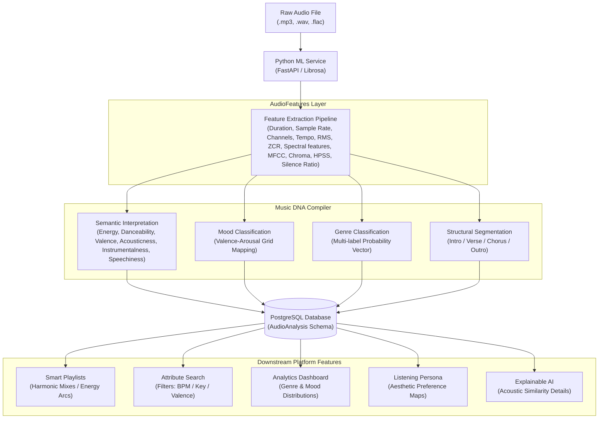

# MusicSense Music DNA Specification

The detailed design, structure, mathematical models, and application workflows of Music DNA inside MusicSense: An AI-powered Music Intelligence Platform.

---

## Overview
Music DNA is the explicit, structured, human-readable semantic profile generated from raw audio signals. While raw audio represents physical sound waves, the **AudioFeatures** layer represents the intermediate physical/mathematical output of the digital signal processing (DSP) pipeline, and the **Music Genome** represents high-dimensional, implicit vector space embeddings. **Music DNA** translates these representations into standardized, structured, and queryable semantic attributes. It acts as the descriptive metadata footprint of a song, capturing its acoustic properties, structural markers, emotional moods, and multi-label genres.

## Purpose
Raw amplitude time-series arrays and dense 128-dimensional floating-point vectors are unintuitive for users and cannot be filtered or indexed by standard database engines. 

Music DNA exists to bridge this gap. By consuming the physical metrics of the **AudioFeatures** layer (such as frequency distributions, transients, and spectral energy) and passing them to classification models, the **Music DNA Compiler** compiles these metrics into understandable percentages and categories, providing the database layer with concrete fields (e.g. `energy`, `danceability`, `valence`) that power frontend filters, visual dashboard charts, search engines, and explainable recommendation systems.

## Design Goals
- **Human Readability**: Map raw digital signal processing (DSP) and machine learning outputs to intuitive, semantic concepts.
- **Query and Index Efficiency**: Structure the DNA schema to support fast relational indexing, sorting, and conditional database queries.
- **Determinism**: Ensure that given the same underlying ML models and audio file, the generated Music DNA remains consistent and reproducible.
- **Explainability**: Provide the foundation for explainable AI (XAI) features, enabling the system to tell users *why* two tracks are grouped together.

## Current Status
Sprint 1.4 is complete. The Python ML service (`ml-service`) implements raw audio ingestion, single-load waveform reading, and extraction of physical and acoustic features as the **AudioFeatures** layer (comprising duration, sample rate, channels, tempo, RMS, ZCR, spectral centroid, spectral bandwidth, rolloff, spectral contrast, MFCC means, Chroma means, HPSS energies, and silence ratio). The next milestone is implementing the **Music DNA Compiler** to map these features to high-level semantic tags like `energy`, `danceability`, and `valence`, and writing them to the database schema.

## Future Scope
We plan to expand the Music DNA structure to support:
- **Time-Series DNA Maps**: Storing dynamic attribute fluctuations over time (e.g. tempo changes, energy curves, and mood shifts across a track's duration) rather than single average values.
- **Instrument Segmentation Arrays**: Tracking dynamic percentage values for dominant active instruments (e.g., Acoustic Guitar, Synth, Acoustic Piano).
- **Structural Section Boundaries**: Timestamp arrays marking intro, verse, chorus, bridge, and outro segments.

## Possible Improvements
- **Interactive User Overrides**: Implement a feedback mechanism allowing trusted users or creators to manually adjust DNA tags, using the difference between predicted and corrected values to refine future model training runs.

---

## Audio Feature & Music DNA Processing Flow

The diagram below illustrates how raw audio is loaded once to extract physical DSP parameters (`AudioFeatures`), how the `Music DNA Compiler` interprets these into a semantic `Music DNA` record, and how that record subsequently powers the platform's core features.



---

## Philosophy: AudioFeatures vs. DNA vs. Genome
Within MusicSense, we maintain a clear distinction across these three representation layers:

1. **AudioFeatures (Physical & Mathematical)**:
   * Consists of direct, raw digital signal processing (DSP) parameters extracted from the audio waveform (e.g. sample rate, channels, RMS energy curve, zero crossing rates, spectral centroid, MFCC means, Chroma pitch vectors).
   * It represents the objective physical characteristics of sound waves and acts as the input to classification and embedding models.
   * *Analogy: The raw data from a biometric scanner (fingerprint scans, facial measurements).*

2. **Music DNA (Semantic & Explanatory)**:
   * Consists of interpreted, human-readable semantic concepts compiled from the `AudioFeatures` layer (e.g., Key: G Minor, Tempo: 120 BPM, Energy: 68%, Danceability: 74%, mood profiles).
   * It is human-readable, easily queryable via standard SQL, and used to generate charts and explain relationships.
   * *Analogy: The physical description of a person (height, eye color, hair color).*

3. **Music Genome (Geometric & Latent)**:
   * Consists of implicit, high-dimensional vector embeddings (128-dimensional float arrays).
   * It is processed mathematically using vector distance formulas (like cosine similarity) and is optimized for capturing abstract sonic textures and patterns.
   * *Analogy: The actual biological DNA sequence, containing deep, non-obvious relationship indicators.*

Music DNA serves as the user-facing explanation engine, translating the mathematical distances of the Music Genome into clear, actionable descriptions.

---

## Structured DNA Schema (JSON Representation)
Every analyzed track generates a JSON payload committed to the database. The structured schema is defined below:

```json
{
  "songId": "7b8e5c4a-3f9d-4e2a-8b1c-0d9e8f7a6b5c",
  "metadata": {
    "title": "Acoustic Horizon",
    "artist": "Echo Chamber",
    "duration": 242.5,
    "sampleRate": 22050,
    "analysisVersion": "1.0.0"
  },
  "acousticFeatures": {
    "tempo": 118.4,
    "tempoDrift": 0.05,
    "musicalKey": "G",
    "mode": "minor",
    "camelotKey": "6A",
    "timeSignature": "4/4",
    "energy": 0.68,
    "danceability": 0.74,
    "valence": 0.58,
    "acousticness": 0.42,
    "instrumentalness": 0.15,
    "speechiness": 0.04,
    "loudnessLUFS": -14.2
  },
  "genreDistribution": {
    "electronic": 0.65,
    "ambient": 0.25,
    "downtempo": 0.10
  },
  "moodProfiles": {
    "calm": 0.85,
    "focus": 0.72,
    "happy": 0.45,
    "dark": 0.12
  },
  "structuralSegments": [
    { "label": "intro", "start": 0.0, "end": 15.2 },
    { "label": "verse_1", "start": 15.2, "end": 48.0 },
    { "label": "chorus_1", "start": 48.0, "end": 80.5 },
    { "label": "verse_2", "start": 80.5, "end": 113.1 },
    { "label": "chorus_2", "start": 113.1, "end": 145.6 },
    { "label": "bridge", "start": 145.6, "end": 178.0 },
    { "label": "chorus_3", "start": 178.0, "end": 210.5 },
    { "label": "outro", "start": 210.5, "end": 242.5 }
  ]
}
```

---

## Detailed DNA Feature Specifications

### 1. Acoustic Features
* **Tempo (BPM)**: Calculated as the average rate of beats per minute. A secondary `tempoDrift` metric tracks tempo variance, distinguishing locked drum-machine tracks (zero drift) from organic live performances (high drift).
* **Musical Key & Mode**: Determined by chroma spectral energy vectors mapped to major/minor templates. We translate standard keys into **Camelot Keys** (e.g. `6A` for G minor) to simplify harmonic calculations.
* **Energy**: Calculated from high-frequency energy ratios, spectral centroid heights, and overall signal loudness. Captures the intensity and activity of the track.
* **Danceability**: Measures rhythmic stability and beat strength. A track with a steady, dominant 4-on-the-floor kick drum score higher than a syncopated jazz piece.
* **Valence**: Measures the emotional positivity of the track. Higher valence values align with bright, optimistic tones; lower values align with dark, melancholic tones.
* **Acousticness**: The probability that the track was recorded with acoustic instruments rather than synthesizers or electric amplification.
* **Instrumentalness**: The probability that the track contains no vocal elements.
* **Speechiness**: Detects the presence of spoken words (differentiating vocals, audiobooks, or rap from sung music).

### 2. Mood Features (Valence-Arousal Mapping)
Mood classification utilizes a 2D **Valence-Arousal (VA) Coordinate Grid**, representing the emotional spectrum:

```
                      Arousal (High)
                            ^
            Aggressive      |      Energetic / Party
            Dark            |      Happy
                            |
   <------------------------+------------------------> Valence (High)
   Valence (Low)            |
            Sad             |      Calm / Focus
            Melancholic     |      Romantic
                            v
                      Arousal (Low)
```

The system maps coordinates directly to semantic categories:
* **High Arousal, High Valence**: Happy, Energetic, Party.
* **High Arousal, Low Valence**: Aggressive, Dark, Tense.
* **Low Arousal, High Valence**: Calm, Relaxing, Romantic, Focus.
* **Low Arousal, Low Valence**: Sad, Melancholic.

### 3. Genre Features (Multi-label Probabilities)
Genres are stored as a multi-label probability distribution. Because music is hybrid, storing genres as percentages prevents the system from mislabeling tracks. If a track blends synthwave and metal, it is recorded as `{"electronic": 0.60, "metal": 0.40}`, enabling it to appear in searches and similarity matches for both genres.

---

## Similarity Metrics (Acoustic Matching)
While the **Music Genome** computes vector similarity using cosine distance over high-dimensional embeddings, **Music DNA** calculates similarity over specific, user-selected parameters:

1. **Tempo Distance**:
   $$\text{Dist}_{\text{BPM}}(A, B) = | \text{BPM}_A - \text{BPM}_B |$$
2. **Key Compatibility (Camelot Distance)**:
   Calculated by comparing positions on the Camelot Wheel. Compatible keys must be adjacent or identical (e.g., $6A$ is compatible with $6A$, $5A$, $7A$, and $6B$).
3. **Attribute Distance (Euclidean)**:
   Uses normalized scalar parameters (Energy, Valence, Danceability) to find acoustic matches:
   $$\text{Dist}_{\text{Attr}}(A, B) = \sqrt{(\text{En}_A - \text{En}_B)^2 + (\text{Val}_A - \text{Val}_B)^2 + (\text{Dan}_A - \text{Dan}_B)^2}$$

---

## Visualization
Music DNA is displayed in the UI using interactive, clean interfaces:
* **Radar Charts**: Displaying the core attributes (Energy, Valence, Danceability, Acousticness, Instrumentalness) on a 5-axis polar chart.
* **Visual DNA Cards**: Clean UI cards themed dynamically based on mood coordinates (e.g., deep charcoal for dark moods, emerald green for high-energy tracks).
* **Waveform Annotation**: Segmenting playback bars into color-coded sections representing intro, verse, chorus, and outro boundaries.

---

## How Music DNA Powers Platform Features

### 1. Smart Playlists
* **Harmonic Sorting**: The system sorts playlist queues by matching Camelot key codes, ensuring smooth transitions without harmonic clashes.
* **Energy Arcs**: Sorts songs along mathematical curves (e.g. an "Energy Ramp" that starts low and builds to a high-energy peak).
* **Context Curation**: Auto-generates playlists matching specific DNA criteria (e.g. "Focus" playlists filter for high instrumentalness and low/moderate tempo).

### 2. Search Engine
* **Acoustic Filtering**: Users can search for tracks using specific numerical boundaries (e.g., "Tempo: 120-130 BPM AND Energy > 70%").
* **Semantic Parsing**: Converts natural language requests (e.g., "happy acoustic songs") into specific parameter filters (`valence > 70%` and `acousticness > 60%`).

### 3. Analytics Dashboard
* **Library Summaries**: Aggregates track DNA records to render graphs of the user's favorite keys, tempos, and mood distributions.
* **Library Health**: Identifies low-resolution files or duplicate tracks using acoustic properties.

### 4. User Taste Intelligence
* **Taste Profile construction**: Computes the average of all Music DNA vectors in a user's library, generating a personalized **Taste Index**.
* **Listening Personas**: Assigns personas (e.g. "The Explorer") based on the statistical entropy and diversity of the user's library DNA records.

### 5. Conversational AI Assistant
* **Natural Query Execution**: Translates conversational prompts into database queries (e.g., "Why did you recommend this song?" triggers a DNA comparison showing overlapping energy, key, and mood metrics).
