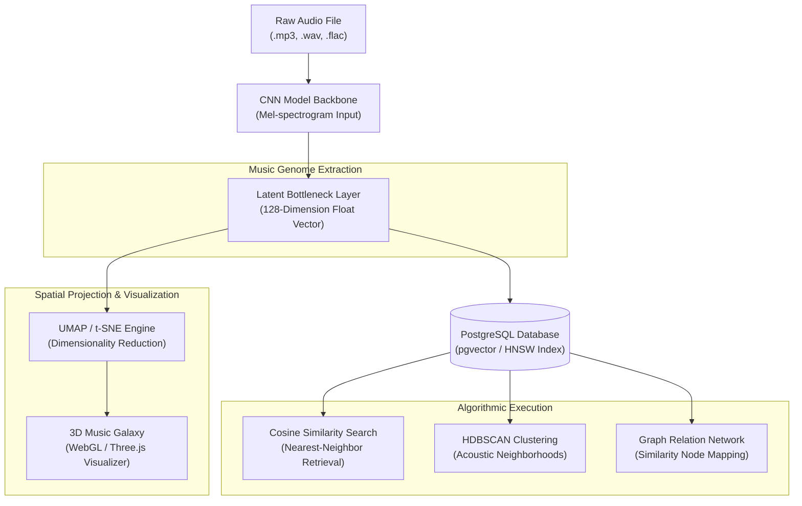
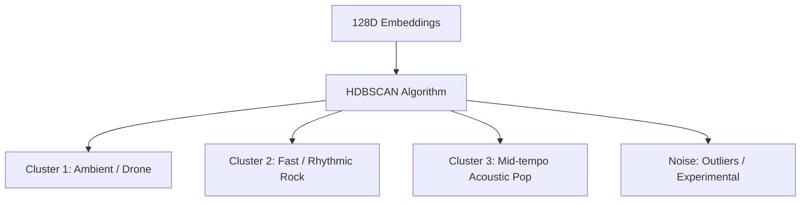
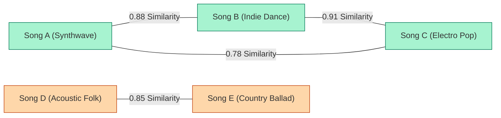

# MusicSense Music Genome Specification

The mathematical definitions, vector architectures, similarity query pipelines, and spatial mapping concepts of the Music Genome inside MusicSense: An AI-powered Music Intelligence Platform.

---

## Overview
The Music Genome is the implicit representation layer of MusicSense. Rather than relying on human-readable labels (which form the **Music DNA**), the Music Genome maps every track into a continuous, high-dimensional vector space. Using dense feature embeddings extracted from deep convolutional neural networks (CNNs), the Genome represents the abstract textures, timbral shapes, and stylistic relationships of audio tracks. This spatial mapping allows MusicSense to perform geometric operations, such as similarity calculations, spatial clustering, and vector-graph recommendations.

## Purpose
Traditional relational databases and SQL query builders excel at filtering categorical fields (e.g., "Genre = Rock" or "BPM > 120"), but they cannot calculate stylistic affinity or acoustic similarity. A track by a classic rock artist might share more acoustic similarity with a modern indie electronic track than with a classic rock ballad. 

The Music Genome exists to solve this problem. By encoding raw audio features into a dense 128-dimensional mathematical vector, it enables the platform to perform continuous spatial searches, finding connections that traditional text metadata would miss.

## Design Goals
- **High-Dimensional Fidelity**: Ensure the vector embedding space preserves subtle acoustic relationships, such as vocal characteristics, instrumental mixtures, and structural dynamics.
- **Sub-Millisecond Latency**: Design vector indexing and query pipelines to perform similarity lookups over tens of thousands of tracks in under 10 milliseconds.
- **Decoupled Vector Indexing**: Abstract the vector database interface to allow easy switching between local database extensions (e.g., pgvector) and dedicated cloud vector databases.
- **Geometric Personalization**: Enable algebraic operations on user profiles, allowing taste vectors to be combined, subtracted, or projected onto specific sub-spaces.

## Current Status
The project is configuring the PostgreSQL database with the `pgvector` extension. In the backend, the Prisma client is set up to execute raw SQL queries to store and compare vectors. The `ml-service` is establishing the model pipeline to extract 128-dimensional embeddings from intermediate bottleneck layers.

## Future Scope
We plan to implement:
- **Hierarchical Navigable Small World (HNSW) Indexing**: To scale vector searches as catalog sizes grow.
- **Interactive Music Galaxy View**: A WebGL-based 3D visualization mapping the user's entire library, where they can explore, group, and select songs directly in vector space.
- **Joint Text-Audio Embedding Space (CLAP)**: Allowing text query vectors to map directly to audio vectors for semantic "Search by Feeling."

## Possible Improvements
- **Product Quantization (PQ)**: Compressing 128-dimensional float vectors into compact byte arrays to reduce in-memory cache footprints and speed up index builds.

---

## High-Dimensional Vector Projection Pipeline

The diagram below shows how the ML service extracts the latent vector (Music Genome) and projects it into both database storage and 3D visual coordinates (Music Galaxy).



---

## Song Embeddings
A song embedding is a 128-dimensional vector composed of floating-point numbers, representing a track's position in the latent feature space:

$$\mathbf{v} = [x_1, x_2, x_3, \dots, x_{128}], \quad x_i \in \mathbb{R}$$

### Extraction Mechanism
During Phase 5 (AI Processing), when an audio file is ingested, the system downsamples it, computes Mel-frequency spectrograms, and feeds them into a convolutional neural network. 

Rather than extracting the final output layer (which yields genre and mood probability distributions for the Music DNA), the system extracts the activations from the **intermediate bottleneck layer** (the fully connected layer right before the classification heads). This latent space captures rich, unlabelled acoustic textures (e.g. percussion pattern densities, vocal timbres, frequency envelopes) that are lost in the final classification.

---

## Vector Databases (`pgvector` Integration)
We use the `pgvector` extension in PostgreSQL to store and query the 128-dimensional Music Genome embeddings natively.

### Schema Definition
Prisma does not support custom vector types natively. We manage this by defining a standard column in the Prisma schema and running a migration to alter the table type:

```sql
-- Migration step to enable pgvector and add vector columns
CREATE EXTENSION IF NOT EXISTS vector;

ALTER TABLE "AudioAnalysis" 
ADD COLUMN "embedding" vector(128);
```

### HNSW Indexing
To prevent sequential table scans on similarity searches, we configure a Hierarchical Navigable Small World (HNSW) index, which builds a multi-layer graph of vectors for fast search:

```sql
CREATE INDEX ON "AudioAnalysis" 
USING hnsw (embedding vector_cosine_ops) 
WITH (m = 16, ef_construction = 64);
```

### Similarity Query Execution
To find the top 5 closest songs to a target embedding vector, the Express backend executes a raw SQL query using the cosine distance operator (`<=>`):

```sql
SELECT "musicFileId", "genre", "tempo", (embedding <=> $1) AS distance
FROM "AudioAnalysis"
ORDER BY embedding <=> $1
LIMIT 5;
```

---

## Similarity Search
To evaluate the similarity between Song $A$ ($\mathbf{u}$) and Song $B$ ($\mathbf{v}$), the Music Genome uses **Cosine Distance**. Unlike Euclidean distance (which measures the straight-line distance between points), Cosine Distance evaluates the angle between the vectors, focusing on the directional alignment of features rather than absolute volume or file length:

$$\text{Cosine Distance}(\mathbf{u}, \mathbf{v}) = 1 - \frac{\mathbf{u} \cdot \mathbf{v}}{\|\mathbf{u}\| \|\mathbf{v}\|} = 1 - \frac{\sum_{i=1}^{n} u_i v_i}{\sqrt{\sum_{i=1}^{n} u_i^2} \sqrt{\sum_{i=1}^{n} v_i^2}}$$

* A distance of `0.0` indicates identical acoustic profiles.
* A distance of `1.0` indicates orthogonal (completely unrelated) profiles.

---

## Spatial Clustering
To organize music libraries without manual tag entry, the Music Genome uses density-based clustering algorithms:



### Algorithmic Execution
1. The Express server retrieves all track embeddings for a user's library.
2. The ML service runs **HDBSCAN** (Hierarchical Density-Based Spatial Clustering of Applications with Noise) over the 128D space.
3. Tracks are grouped into density-based clusters, representing natural acoustic neighborhoods (e.g. ambient/electronic tracks, high-energy/distorted rock tracks).
4. Tracks that do not fit any cluster are classified as "noise" (outliers), highlighting rare or unique items in the user's library.

---

## Graph Relationships
The continuous vector relationships of the Music Genome can be represented as a **Similarity Graph**:
* **Nodes**: Individual music tracks.
* **Edges**: Links created between two nodes if their cosine distance is below a threshold (e.g. $\text{Distance} \le 0.15$).
* **Edge Weights**: The cosine similarity score ($1 - \text{Distance}$).



This graph structure enables **Graph-based Recommendation Walkways**: instead of suggesting the absolute nearest neighbors, the system traverses similarity edges to help users discover connected tracks organically.

---

## Music Galaxy (3D Space Mapping)
The Music Galaxy is the visual interface for the Music Genome. To display the 128-dimensional embedding space on a 3D canvas, the system runs **UMAP** (Uniform Manifold Approximation and Projection):

* **Dimension Reduction**: UMAP compresses the 128 dimensions down to 3 coordinates ($x, y, z$) while preserving the relative distances and cluster structures.
* **Rendering**: A WebGL interface renders each track as a colored star in a 3D cosmos. Tracks with similar acoustic profiles group together into visual constellations.
* **Interactive Navigation**: Users can click, fly, and zoom through the galaxy. Selecting a star previews the track and highlights its nearest neighbors.

---

## Recommendation System
The Music Genome powers the recommendation engine through a multi-stage filtering pipeline:

```
[Target Song Embedding] 
          │
          ▼
┌─────────────────────────────────┐
│  1. Vector Nearest Neighbors    │ <=> Retrieve top 100 closest vectors
└─────────────────────────────────┘
          │
          ▼
┌─────────────────────────────────┐
│  2. Dynamic Persona Filters     │ <=> Apply user's current mood and style preference
└─────────────────────────────────┘
          │
          ▼
┌─────────────────────────────────┐
│  3. Harmonic Matching Filters   │ <=> Sort and filter by key compatibility (Camelot Wheel)
└─────────────────────────────────┘
          │
          ▼
┌─────────────────────────────────┐
│  4. Novelty & Diversity Mixer   │ <=> Inject discovery outliers to prevent recommendation bubbles
└─────────────────────────────────┘
          │
          ▼
[Final 5 Recommendations]
```

---

## Future AI Models

### 1. Contrastive Language-Audio Pre-training (CLAP)
Currently, natural language queries ("melancholic piano for writing") must be translated into explicit ranges (valence, instrumentalness). We plan to integrate a CLAP model:
* **Shared Embedding Space**: Maps text descriptions and raw audio signals into the same high-dimensional space.
* **Direct Vector Queries**: The system encodes the user's search text into a query vector, which retrieves matching audio vectors directly from the database using cosine similarity.

### 2. Autoencoder Reconstructions (Style Transfer)
By training deep variational autoencoders (VAEs) on the embedding space, the platform will enable:
* **Acoustic Morphing**: Create transitions between two distinct tracks by interpolating between their vector embeddings.
* **Style Transfer**: Apply the style vector of one song to the structural vector of another.
