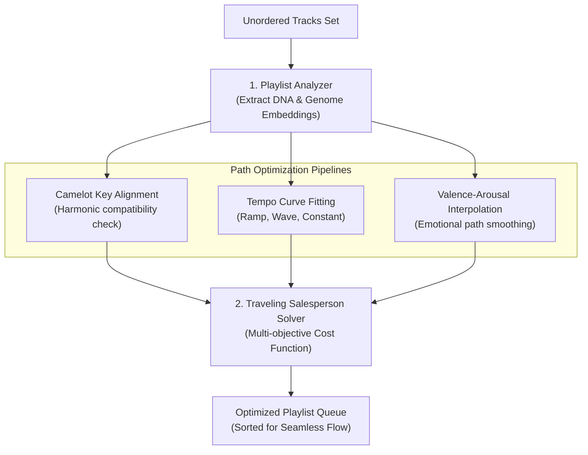
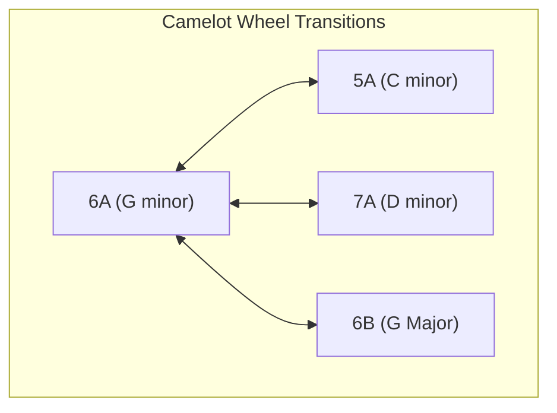

# MusicSense Playlist Engine Specification

The system design, algorithms, mathematical sorting models, and context architectures of the Intelligent Playlist Engine inside MusicSense: An AI-powered Music Intelligence Platform.

---

## Overview
The Playlist Engine is the curation and optimization engine of MusicSense. Utilizing both the semantic descriptors from **Music DNA** (BPM, key signatures, energy levels, valence scores) and the latent spatial relationships from the **Music Genome** (128D embeddings), the engine automatically constructs, analyzes, splits, and reorders playlists. By calculating transitions between tracks, the engine ensures a seamless listening experience designed for specific user contexts and cognitive states.

## Purpose
Traditional music playlists are static groupings of tracks, typically sorted alphabetically or by addition date. This results in jarring transitions (e.g. a low-tempo acoustic ballad immediately followed by a high-BPM electronic track), which disrupts flow states. 

The Playlist Engine exists to resolve this transition friction. By treating playlist construction as a mathematical path optimization problem over high-dimensional audio spaces, the engine arranges tracks to follow smooth, gradual arcs in tempo, mood, and musical key.

## Design Goals
- **Seamless Flow**: Minimize transition friction between consecutive tracks by optimizing tempo steps, harmonic compatibility, and mood continuity.
- **Context Customization**: Define strict acoustic parameter envelopes matching specific user activities (e.g. high-energy workouts, focus coding sessions).
- **Algorithmic Transparency**: Provide users with visual metrics showing the "flow quality" and transition statistics of their playlists.
- **Scale Independence**: Ensure sorting and splitting algorithms can process playlists containing hundreds of tracks in under a second.

## Current Status
Database schemas for user files and AI analyses are established. The REST API structures support basic file retrievals. The sorting, splitting, and path optimization algorithms described in this document are scheduled for implementation during Phase 6 (Dashboard & Player integration).

## Future Scope
We plan to introduce:
- **Biometric Integration**: Adjusting playlist tempo (BPM progression) in real-time based on heart rate telemetry from connected smartwatches.
- **Client-Side DJ-Style Transition Mixer**: Utilizing the Web Audio API to automatically adjust crossfade lengths and execute pitch-matching beat-mix transitions based on key compatibility and BPM relationships.

## Possible Improvements
- **Markov Chain Transitions**: Training Markov transition matrices on user skip history to discover customized transition paths between genres.

---

## Playlist Optimization Architecture



---

## Core Core Subsystems

### 1. Playlist Splitter
- **Function**: Deconstructs large, unorganized folders of music into distinct, cohesive playlists.
- **Algorithm**: Runs **K-Means** or **HDBSCAN** clustering on the 128-dimensional Music Genome space. Once clusters are isolated, the system computes the centroid of each cluster, projects it back onto the Music DNA semantic space, and auto-names the playlist based on dominant genres and mood coordinates (e.g., "Mellow Jazz Focus" or "Energetic Indie Electronic").

### 2. Playlist Analyzer
- **Function**: Audits and scores a playlist's consistency, diversity, and transition quality.
- **Metrics**:
  - **Acoustic Entropy**: Measures playlist diversity. High entropy indicates eclectic playlists (many genres/tempos); low entropy indicates highly consistent moods.
  - **Flow Score (0-100)**: Evaluates the average transition friction between adjacent tracks. A playlist with compatible keys and gradual BPM steps scores close to 100.

### 3. Playlist Optimizer
- **Function**: Reorders a set of tracks to maximize flow quality.
- **Mathematical Formulation**: Formulated as a modified **Traveling Salesperson Problem (TSP)**, where the "cities" are tracks, and the "distances" are transition costs. (See Path Optimization Section).

### 4. AI Playlist Generator
- **Function**: Automatically builds a playlist from a single seed input (song, artist, or mood).
- **Process**: Executes a $k$-Nearest Neighbors ($k$-NN) query in the Music Genome space to find acoustically similar tracks, applying database SQL filters (from the Music DNA) to match specific metadata targets.

---

## Path Optimization & Smart Ordering Algorithms

To organize a playlist for optimal transition flow, the Playlist Engine solves a path minimization problem over a composite cost matrix.

### The Cost Function
The transition cost $C_{i,j}$ between Song $i$ and Song $j$ is calculated as:

$$C_{i,j} = w_1 \cdot \text{Cost}_{\text{BPM}}(i, j) + w_2 \cdot \text{Cost}_{\text{Key}}(i, j) + w_3 \cdot \text{Cost}_{\text{Mood}}(i, j)$$

Where the weights $w_1, w_2, w_3$ are adjusted based on the user's selected sorting strategy (e.g., prioritizing tempo transitions for workouts vs. key transitions for DJ mixes).

---

### 1. BPM Progression (Tempo Sorting)
To avoid abrupt rhythm changes, the engine minimizes the squared distance between consecutive track tempos:

$$\text{Cost}_{\text{BPM}}(i, j) = \left( \frac{\text{BPM}_i - \text{BPM}_j}{\text{Max BPM Difference}} \right)^2$$

#### Sorting Strategies
- **Constant Tempo**: Minimizes BPM differences to maintain a consistent speed (ideal for running or study).
- **Energy Ramp**: Sorts tracks in ascending order of BPM to build intensity over time.
- **Wave Arc**: Arranges tracks to follow a sinusoidal tempo curve (build up, peak, cool down, repeat).

---

### 2. Harmonic Compatibility (Camelot Wheel Graph)
Harmonic mixing prevents chord clashes during transitions. We map standard musical keys to the **Camelot Wheel** coordinate system (values from $1$ to $12$ followed by $A$ for minor keys or $B$ for major keys).



The transition cost is calculated using adjacency distances on the Camelot graph:
* **Distance = 0 (Same Key)**: Cost = $0.0$.
* **Distance = 1 Step (Adjacent Key / Mode Shift)**: Cost = $0.2$ (e.g. transitioning from $6A$ to $5A, 7A,$ or $6B$).
* **Distance > 1 Step (Incompatible Keys)**: Cost = $1.0$.

---

### 3. Mood Progression (Valence-Arousal Pathing)
To smooth emotional transitions, the engine calculates the Euclidean distance between consecutive tracks in the 2D Valence-Arousal (VA) space:

$$\text{Cost}_{\text{Mood}}(i, j) = \sqrt{(\text{Valence}_i - \text{Valence}_j)^2 + (\text{Arousal}_i - \text{Arousal}_j)^2}$$

This ensures that the emotional transition from a melancholy, introspective song to an upbeat, celebratory song occurs via intermediate mood stages (e.g. moving from Sad $\rightarrow$ Calm $\rightarrow$ Happy).

---

### Solving the TSP Path
Because solving the TSP is NP-Hard, calculating the optimal order for large playlists ($N > 30$ tracks) can become computationally expensive. The Playlist Engine uses heuristic algorithms:
- **Nearest Neighbor Search (Greedy Approach)**: Start with a seed track, select the next track with the lowest transition cost $C_{i,j}$, and repeat. Works in $\mathcal{O}(N^2)$ time.
- **2-Opt Local Search**: Starts with a random ordering and systematically swaps pairs of tracks to reduce the overall transition cost until a local minimum is reached. Works in $\mathcal{O}(N^2)$ time and yields highly optimized, natural-feeling flows.

---

## Context-Specific Playlist Architectures

```
     COGNITIVE STATE                      PHYSICAL STATE
  ┌──────────────────────┐             ┌──────────────────────┐
  │    Coding Playlist   │             │   Workout Playlist   │
  │                      │             │                      │
  │ - Instrumental > 90% │             │ - Energy > 80%       │
  │ - Constant Tempo     │             │ - Energy Ramp Arc    │
  │ - Low Speechiness    │             │ - Tempo 120-140 BPM  │
  └──────────────────────┘             └──────────────────────┘
```

### 1. Workout Playlist
- **Objective**: Match high-intensity workouts, cardiovascular training, or rhythmic runs.
- **Music DNA Constraints**:
  - `Energy`: $> 80\%$
  - `Tempo`: $120 - 140$ BPM
  - `Acousticness`: $< 20\%$
- **Optimizer Strategy**: **Energy Ramp**. Tracks are ordered in ascending BPM steps, building to a peak energy level, followed by a 2-track cooldown ramp.

### 2. Study Playlist
- **Objective**: Induce a calm, focused mental state for reading, writing, or learning.
- **Music DNA Constraints**:
  - `Instrumentalness`: $> 90\%$
  - `Speechiness`: $< 5\%$
  - `Valence`: Moderate ($40\% - 65\%$, avoiding intense happiness or sadness)
  - `Tempo`: $60 - 90$ BPM
- **Optimizer Strategy**: **Constant Tempo**. Sorts tracks to maintain a steady rhythm, reducing distractions.

### 3. Coding Playlist
- **Objective**: Support deep focus, problem-solving, and entry into flow states.
- **Music DNA Constraints**:
  - `Genre`: Electronic, Ambient, Techno, or Downtempo.
  - `Danceability`: $> 70\%$ (repetitive rhythm anchors concentration).
  - `Speechiness`: $< 3\%$
  - `Tempo`: $110 - 125$ BPM
- **Optimizer Strategy**: **Wave Arc**. Orders tracks in gradual cycles of energy to align with focus sprints, while maintaining compatible key transitions to keep the background audio seamless.
