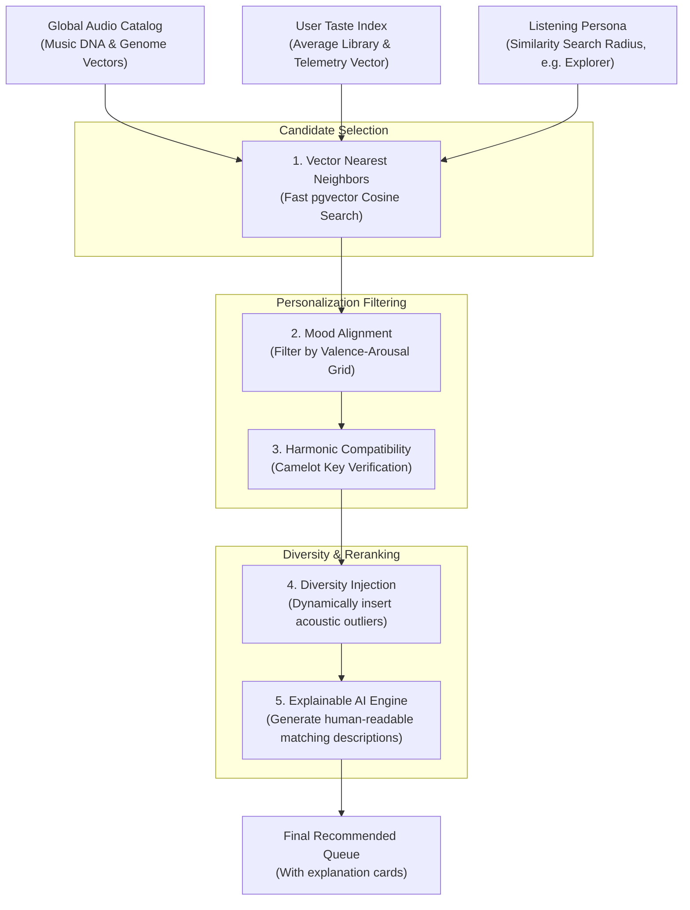

# MusicSense Recommendation Engine Specification

The system design, content-filtering models, personalization formulas, and explainability frameworks of the Recommendation Engine inside MusicSense: An AI-powered Music Intelligence Platform.

---

## Overview
The Recommendation Engine is the personalization core of MusicSense. Rejecting traditional popularity-driven models, the engine relies on Content-Based Filtering powered by **Music DNA** (acoustic, mood, and genre metadata) and the **Music Genome** (128D latent space embeddings). By calculating the geometric distance between tracks and the user's dynamic **Taste Index** and **Listening Persona**, the engine delivers hyper-personalized, genre-agnostic recommendations.

## Purpose
Traditional music platforms rely heavily on Collaborative Filtering (analyzing play counts, likes, and shares of millions of users). While effective for mainstream hits, this approach introduces two fatal flaws:
1. **Popularity Bias**: Popular tracks are recommended repeatedly, while niche, independent, or newly uploaded tracks are ignored.
2. **The Cold Start Problem**: New tracks with zero play history cannot be recommended until they gather interaction data.

MusicSense exists to resolve these limitations. By analyzing the audio signal itself, the Recommendation Engine treats all tracks equally, allowing newly uploaded indie tracks to be recommended immediately alongside mainstream hits if their acoustic profiles align.

## Design Goals
- **Audio-First Matching**: Prioritize acoustic characteristics (Music DNA and Genome embeddings) over play history or popularity tags.
- **Explainable Curation**: Provide user-facing explanations for every recommended track, detailing the exact acoustic attributes that triggered the match.
- **Dynamic Adaptability**: Update user taste representations in real-time based on skip telemetry, active playback durations, and slider inputs.
- **Diversity Enforcement**: Prevent recommendation bubbles by dynamically injecting stylistic outliers based on the user's library entropy.

## Current Status
The database models support storing user preferences and file analysis profiles. The API layers are structured to retrieve library metadata. The recommendation and personalization algorithms are scheduled for implementation during Phase 6 (Dashboard & Player integration).

## Future Scope
We plan to implement:
- **Contextual Ingestion Routes**: Dynamically adjusting recommendation weights based on client telemetry (e.g. time of day, location, calendar events).
- **Multi-User Group Recommendations**: Merging multiple User Taste Indexes using vector addition to generate playlists for shared environments.

## Possible Improvements
- **Interactive Taste Sculpting**: A frontend dashboard panel where users can view their active Taste Index as a 3D vector model and adjust weights manually.

---

## Recommendation Generation Pipeline

The diagram below details the pipeline that filters candidate tracks down to a personalized list of recommendations.



---

## Content-Based Filtering Subsystems

Unlike platforms that analyze user behavior, MusicSense analyzes audio signals. The recommendation algorithm blends two distinct layers of content representation:

### 1. Music Genome (Geometric Search)
- **Role**: Captures abstract acoustic qualities, instrument combinations, and timbres.
- **Execution**: The engine converts the target track or User Taste Profile into a query vector and retrieves the nearest neighbors in the 128-dimensional latent space using cosine similarity.

### 2. Music DNA (Semantic Filtering)
- **Role**: Enforces musical rules and user preferences.
- **Execution**: The engine applies hard filters on metadata (e.g., matching the Camelot key wheel for transitions, limiting search to instrumental tracks for study, or grouping tracks by mood coordinates).

---

## User Taste Index
The **User Taste Index** ($\mathbf{T}$) is a multi-dimensional representation of a user's musical preferences. It is composed of a **Taste DNA Vector** (normalized semantic properties) and a **Taste Genome Vector** (a 128D embedding representing average acoustic texture preference).

```
                      User Taste Profile (T)
  ┌─────────────────────────────────────────────────────────────┐
  │                                                             │
  │ - Taste DNA Vector:                                         │
  │   [Energy: 72%, Valence: 54%, Tempo: 118 BPM, ...]          │
  │                                                             │
  │ - Taste Genome Vector:                                      │
  │   [x1: 0.12, x2: -0.45, x3: 0.78, ... x128: -0.22]          │
  │                                                             │
  └─────────────────────────────────────────────────────────────┘
```

### Mathematical Calculation
The Taste Vector is calculated by taking the weighted average of the embeddings of all tracks in the user's library:

$$\mathbf{T} = \frac{\sum_{i=1}^{N} w_i \cdot \mathbf{v}_i}{\sum_{i=1}^{N} w_i}$$

Where:
* $\mathbf{v}_i$ is the 128D Genome embedding of Track $i$.
* $w_i$ is the interaction weight of Track $i$, calculated from telemetry logs:

$$w_i = \text{Play Count}_i + (2 \cdot \text{Like Status}_i) - (3 \cdot \text{Skip Count}_i)$$

*This weight ensures that frequently skipped tracks pull the Taste Index away from their coordinate space, while liked tracks pull it closer.*

---

## Listening Persona
The **Listening Persona** represents the user's listening behavior and exploration habits, calculated from library diversity and interaction histories:

| Persona | Definition | Algorithmic Adjustment |
| :--- | :--- | :--- |
| **The Loyalist** | High play count on a narrow set of similar tracks. | Restricts recommendation search radius ($\text{Cosine Distance} \le 0.10$). |
| **The Explorer** | Broad distribution of genres with frequent track skips. | Expands search radius ($\text{Cosine Distance} \le 0.25$) and increases diversity injection. |
| **The Trendsetter** | Focuses on newly analyzed tracks and high-energy genres. | Prioritizes tracks with recent upload timestamps and high arousal DNA scores. |

---

## Diversity Score (Preventing Recommendation Bubbles)
To prevent recommendations from becoming repetitive, the engine monitors the user's **Library Diversity Score** ($D$), calculated using Shannon Entropy over the genre distributions:

$$H(\text{Genre}) = -\sum_{k=1}^{M} p(g_k) \log_2 p(g_k)$$

Where $p(g_k)$ is the proportion of library tracks belonging to Genre $k$.
* **Low Diversity ($H < 1.5$)**: The user has highly focused tastes. The engine recommends very similar tracks but injects a $10\%$ "discovery outlier" (a track further away in vector space) to encourage discovery.
* **High Diversity ($H \ge 1.5$)**: The user enjoys eclectic styles. The engine broadens recommendations across multiple distant clusters.

---

## Explainable AI (XAI)
A key principle of MusicSense is explaining *why* a song was recommended. Instead of displaying generic recommendations, the platform compares the DNA of the recommended track with the user's Taste Index and generates descriptive matching details:

```
  ┌───────────────────────────────────────────────────────────┐
  │  Recommended: "Acoustic Horizon"                          │
  │                                                           │
  │  Matching Rationale:                                      │
  │  - Acoustic Profile: 88% similarity                       │
  │  - Energy: 72% (matches your focus preference)            │
  │  - Key Signature: G minor (harmonically compatible with   │
  │    your last played track, "Echoes")                      │
  │  - Dominant Mood: Calm (92% valence alignment)            │
  └───────────────────────────────────────────────────────────┘
```

---

## Solving the Cold Start Problem
Collaborative recommendation systems cannot recommend new uploads because they lack user playback data. MusicSense resolves this issue through its content-based pipeline:

```mermaid
sequenceDiagram
    autonumber
    actor Creator as Creator Uploads
    participant ML as ML Service (FastAPI)
    participant DB as PostgreSQL (pgvector)
    participant Rec as Recommendation Engine

    Creator->>ML: Uploads "NewTrack.mp3" (zero plays)
    Note over ML: Decode audio;<br/>Extract Mel-spectrogram & Chroma;<br/>Generate 128D Genome Vector
    ML->>DB: Save track metadata & 128D embedding
    DB-->>Rec: Index updated with HNSW graph
    Note over Rec: Another user requests recommendations;<br/>Matches Taste Index using Cosine distance
    Rec->>DB: Query nearest neighbors (pgvector)
    DB-->>Rec: Returns "NewTrack.mp3" (Distance: 0.08)
    Rec-->>Creator: Recommended to matching listeners immediately
```

Within seconds of upload, a new track is processed, indexed, and available for recommendations, eliminating the cold start delay.
