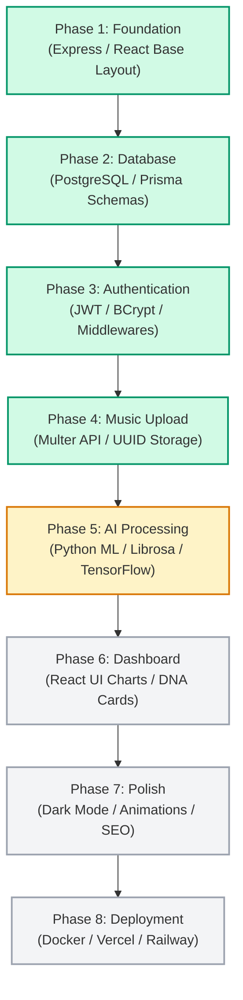

# MusicSense Development Roadmap

A phased, sequential execution plan detailing the development milestones and release cycles of MusicSense: An AI-powered Music Intelligence Platform.

---

## Overview
This roadmap tracks the incremental development of MusicSense from a basic architecture framework to a mature, production-grade intelligence platform. The roadmap is divided into 8 distinct engineering phases, ensuring that structural layers are fully tested and stable before downstream analytics and UI visualizations are constructed.

## Purpose
A complex platform combining audio digital signal processing (DSP), relational schemas, and asynchronous machine learning requires a disciplined development path. Attempting to build frontends or recommendation systems before the underlying models, file ingestion boundaries, and vector spaces are defined leads to heavy refactoring and architectural regression. This roadmap establishes:
1. **Structural Gating**: Ensures backend, database, and pipeline security layers are finalized first.
2. **Resource Allocation**: Guides current focus (AI processing) and sets timelines for UI polish and infrastructure deployment.
3. **Definition of Done**: Defines clear verification standards that must be met before transitioning between phases.

## Design Goals
- **Incremental Stability**: Every milestone completion must result in a buildable, deployable, and type-safe project state.
- **Deliverable Isolation**: Decouple components (e.g., frontend components from ML models) so that parallel development is unblocked.
- **Measurable Milestones**: Maintain clear checklists for each phase to track engineering velocity.

### Current Status
- **Current Phase**: Phase 5 — AI Processing (In Progress)
- **Completed**: Phase 1 (Foundation), Phase 2 (Database schema & migrations), Phase 3 (Authentication backend foundation), Phase 4 (Upload API & storage boundaries), and Sprints 1.1-1.4 (FastAPI microservice setup, basic and advanced DSP feature extraction, modular refactoring).
- **Active Task**: Stage 2 — Music DNA compilation (classifiers and key estimation models) and connecting the Express server upload handler.

## Future Scope
Following Phase 5, the roadmap shifts to visual applications and deployment structures:
- **Phase 6**: Dashboard visualization of Music DNA and library distributions.
- **Phase 7**: Styling, responsiveness, dark mode, and accessibility polish.
- **Phase 8**: Production infrastructure configurations (Docker, CI/CD, database scaling).

## Possible Improvements
- **Continuous Integration Checks**: Introduce auto-linting and test suite runs that automatically block merge requests unless matching roadmap milestone tests pass.
- **Dynamic Task Mapping**: Link roadmap items to GitHub issues to automate status changes in this document.

---

## Development Milestones & Dependencies

---

## Roadmap Phases

### Phase 1 — Foundation (Complete)
Build the foundational structure of the mono-repository.
- [x] Configure Express and Node.js backend workspace in TypeScript.
- [x] Configure React, TypeScript, and Vite frontend workspace.
- [x] Integrate Tailwind CSS and initialize shadcn/ui library configuration.
- [x] Build core routing system using React Router v6.
- [x] Implement initial landing page and layout structure.
- [x] Establish unified Axios HTTP client.
- [x] Implement global Backend Error Handling Middleware.

### Phase 2 — Database (Complete)
Create the database layer and model relationships.
- [x] Provision local PostgreSQL database instance.
- [x] Configure Prisma ORM database connection.
- [x] Design schemas for User, UserSettings, MusicFile, AudioFile, and AudioAnalysis.
- [x] Write and execute initial migrations.
- [x] Create seed scripts for populating development data.

### Phase 3 — Authentication (Complete)
Secure access to the API and manage user accounts.
- [x] Build User Registration and Login APIs.
- [x] Implement secure JWT sign/verify workflows.
- [x] Implement password hashing via BCrypt.
- [x] Establish `authenticateJWT` middleware.
- [x] Secure sensitive API endpoints.
- [x] Build Register and Login pages in the React client.

### Phase 4 — Music Upload (Complete)
Ingest raw audio files into secure server storage.
- [x] Integrate Multer middleware for handling multi-part form uploads.
- [x] Implement size validations (strict 25MB cap) and format restrictions (MP3, WAV, FLAC, OGG, M4A).
- [x] Configure UUID-based file renaming to prevent local directory collisions.
- [x] Map file metadata to `AudioFile` schema in PostgreSQL.
- [x] Create Upload Component in the React client.

### Phase 5 — AI Processing (In Progress)
Build the audio intelligence worker service.
- [x] Setup Python 3.10 virtual environment and dependencies (TensorFlow, Librosa).
- [x] Write audio digital signal processing service using Librosa for feature extraction.
- [x] Extract core metadata and basic DSP features (Sprint 1.2 & 1.3).
- [x] Extract advanced acoustic and timbral features (Sprint 1.4).
- [x] Refactor feature extraction into modular sub-packages under services/extractors (Sprint 1.4 Refactor).
- [x] Synchronize architectural documentation layers (Documentation Sprint).
- [ ] Build classification pipelines for genre and mood (Music DNA Compiler milestone).
- [x] Configure REST interface (FastAPI) inside the ML service.
- [x] Connect the Express server upload handler to trigger ML analysis via HTTP.

### Phase 6 — Dashboard (Planned)
Create user interfaces for visual exploration.
- [ ] Build User Statistics metrics API.
- [ ] Implement UI views showing genre and mood distributions using charting libraries.
- [ ] Integrate React DNA Cards for individual audio track analysis summaries.
- [ ] Create interactive player views displaying waveforms.

### Phase 7 — Polish (Planned)
Refine design elements and optimize page loads.
- [ ] Integrate dynamic dark mode theme configuration.
- [ ] Write micro-animations for transitions.
- [ ] Enforce WCAG accessibility compliance (screen reader tags, keyboard navigation).
- [ ] Implement search engine optimization (SEO) metadata tags.
- [ ] Refine responsive designs across mobile, tablet, and widescreen layouts.

### Phase 8 — Deployment (Planned)
Configure production hosting infrastructure.
- [ ] Write Dockerfiles and configure Docker Compose.
- [ ] Establish CI/CD pipelines (GitHub Actions).
- [ ] Setup Vercel hosting for React Client.
- [ ] Deploy Express API to Railway/Render.
- [ ] Provision production-scale Neon serverless PostgreSQL database.
- [ ] Connect structured logging (Winston) and health monitoring.

---

## Future Enhancements
Planned additions following stable release:
- **Harmonic Playlists**: Auto-sorting playlists to match key scales.
- **Spotify Library Analyzer**: Connect Spotify accounts to import and run DNA comparisons.
- **Audio Similarity Explorer**: Render 3D cluster graphs mapping similarity spaces.
- **Explainable AI Assistant**: Answer natural language queries about library composition.
- **Creator Mastering Dashboard**: Provide instant LUFS compliance checks.

---

## Definition of Done
A phase is considered complete only if it satisfies all of these criteria:
1. **Compilation**: The workspace builds successfully with zero TypeScript or syntax errors.
2. **Responsive**: UI views are verified on mobile, tablet, and desktop layouts.
3. **Tested**: Key controllers, validation parameters, and models have passing test suites.
4. **Clean Code**: Code complies with `conventions.md`, with zero debug logs or console dumps.
5. **Git Versioned**: Changes are committed in clean logical branches with `feat:` or `fix:` prefixes and pushed to origin.